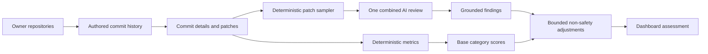

# Dashboard AI Review

## Purpose

The dashboard uses one semantic AI review as a second layer over the
deterministic profile scorer. The AI does not produce category scores. The
server owns the numbers so that the same GitHub evidence produces the same
result on every request.

## Evidence flow



Repository metadata defines the sampling scope only. Stars, forks, repository
size, language popularity, and follower counts are never quality signals.
Commit history is requested with the profile as the author, and commit details
carry author, committer, parent count, and merge metadata. Merge commits are
integration evidence and are excluded from personal category scores.

## GitHub collection budget

The dashboard collector is intentionally bounded per profile:

| Evidence | Maximum |
| --- | ---: |
| candidate repositories | 5 |
| selected active repositories | 3 |
| history commits per repository | 12 |
| candidate commits after dedupe | 30 |
| enriched commit details | 18 |
| associated pull-request lookups | 6 |
| pull-request review lookups | 3 |
| check-run lookups | 6 |
| files per enriched commit | 8 |

The theoretical maximum is 41 GitHub subrequests before the single AI request:
one profile request, one repository request, three history requests, three
root-tree requests, eighteen commit requests, six commit-to-PR requests, three
review requests, and six check-run requests. Failed optional evidence does not
abort the profile; the response exposes the collection summary instead.

This stays below the 50-subrequest-per-Worker-request limit documented by
[Cloudflare Workers limits](https://developers.cloudflare.com/workers/platform/limits/).
GitHub requests remain subject to GitHub authentication and rate limits, so the
collector uses a token when configured and keeps requests sequential in the
repository-first path. See [GitHub REST rate limits](https://docs.github.com/en/rest/using-the-rest-api/rate-limits-for-the-rest-api).

## Patch sample budget

The combined review receives a deterministic, stratified sample:

| Evidence | Maximum |
| --- | ---: |
| selected commits | 3 |
| selected files | 12 |
| characters per patch | 700 |
| total patch characters | 9,000 |
| AI output tokens | 3,200 |
| serialized AI request body | 96 KiB |

Selection covers the latest authored commit, the largest authored commit, and
the latest commit with a relevant safety file or patch signal. Generated output, vendored files,
lockfiles, and build artifacts are excluded. Secrets are redacted before
patches leave the server.

The application rejects a serialized AI request above 96 KiB before sending
it. This is an application guard, not a replacement for Cloudflare's platform
limit; it keeps the compact prompt and output budget comfortably below the
current model context. The current Qwen3 model has a 32,768-token context window according to its
[Cloudflare model page](https://developers.cloudflare.com/ai/models/%40cf/qwen/qwen3-30b-a3b-fp8/).
The character budget leaves room for the system instructions and compact
repository context. `temperature: 0`, `top_p: 0.1`, and
`reasoning_effort: "none"` are used for stable semantic review. The request
uses one combined prompt instead of one request per category.

Cloudflare JSON Mode is deliberately not enabled for the current model: the
[JSON Mode documentation](https://developers.cloudflare.com/workers-ai/features/json-mode/)
lists supported models, and the configured Qwen3 model is not guaranteed by
that list. The server therefore uses strict prompt instructions plus tolerant
JSON extraction and schema validation. A future model switch can add
`response_format` after it is verified against that support list.

## AI contract

The model returns no numeric score:

```ts
interface DashboardAiReviewFinding {
  axis: 'clarity' | 'safety' | 'workflow' | 'complexity' | 'context';
  verdict: 'positive' | 'mixed' | 'negative' | 'unclear';
  impact: 'introduced' | 'fixed' | 'unclear';
  severity: 'low' | 'medium' | 'high';
  commitSha: string;
  filename: string;
  evidence: string;
  category?: 'validation' | 'auth' | 'error-handling' | 'secrets' | 'dependency';
}

interface DashboardAiReviewAssessment {
  confidence: number;
  findings: DashboardAiReviewFinding[];
  status: 'assessed' | 'not-configured' | 'no-evidence' | 'unavailable' | 'invalid-response';
  selectedCommitCount: number;
  patchCount: number;
  patchChars: number;
}
```

Every accepted finding must point to an exact selected filename and commit
SHA. Missing tests, CI, documentation, unfamiliar code, commit frequency,
repository popularity, and truncated context are not negative evidence.

For Safety, only `verdict: "negative"` plus
`impact: "introduced"` is converted into the existing confirmed-risk contract;
the server independently verifies the patch pattern and applies the existing
severity penalties. Fixed and unclear findings never lower Safety.

For Clarity, Workflow, Complexity, and Context, AI can contribute at most a
bounded adjustment of eight points per axis. The adjustment is considered only
when the review is assessed with confidence at least 60 and contains at least
two grounded findings. Positive findings add four points, introduced negative
findings subtract four points, and the result is clamped to ±8. AI cannot
inflate a score from missing evidence.

## Status semantics

| Status | Meaning |
| --- | --- |
| `assessed` | response parsed and grounded findings retained |
| `not-configured` | Cloudflare credentials are missing; deterministic scores remain available |
| `no-evidence` | no usable authored patch was available |
| `unavailable` | upstream AI request failed; deterministic scores remain available |
| `invalid-response` | AI returned content outside the contract; deterministic scores remain available |

The API returns the selected evidence summary, repositories, pull requests,
checks, and AI review status so the UI can distinguish a neutral score from a
measured score. `selectedCommitCount` counts selected commits; `patchCount`
counts selected patch files.

## Implementation locations

- Collector: `server/roast/github-collector.ts`
- Patch sampler: `server/roast/dashboard-patch-selection.ts`
- Combined AI contract and request: `server/roast/dashboard-ai-scoring.ts`
- Deterministic scoring and bounded adjustments: `server/roast/dashboard-profile-scoring.ts`
- Dashboard API boundary: `server/api/dashboard-profile.post.ts`

## Debug logging

The browser does not render the internal scoring dashboard. With
`NUXT_ROAST_DEBUG=true`, the server logs one `dashboard-profile-summary` record
per live analysis. It contains the GitHub and AI durations, collection counts,
all derived metrics, the five scores, overall grade, role, AI status, selected
patch counts, and the number of accepted Safety risks. It deliberately omits
patch contents and secrets, so the log can be copied for inspection without
turning the product UI into a debug surface.
