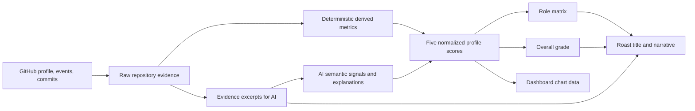

# Dashboard Profile Scoring

## Purpose

The dashboard profile is a structured read of a GitHub repository. It is not
the same thing as the roast intensity or the leaderboard score. Every visible
dashboard card must be derived from one evidence-backed assessment so that a
role such as `Big-Bang Committer` can be understood from the same commit
patterns shown in the charts.

The first real-user exploration target is `lafllamme`. Until the production
pipeline is connected, the dashboard uses explicit mock fixtures that follow
this contract.

## Category status

| Category | Status | Score owner | AI role |
| --- | --- | --- | --- |
| Safety | v1 implemented and validated | deterministic server formula | classify grounded introduced risks only |
| Workflow | v1 implemented and first-pass validated | deterministic server formula | optional explanation, no numeric score |
| Clarity | provisional | existing heuristic | not wired into the final contract |
| Complexity | provisional | existing heuristic | not wired into the final contract |
| Context | provisional | existing heuristic | not wired into the final contract |

Only Safety and Workflow have a documented scoring rule in the current live
slice. The overall grade and role matrix remain exploratory until the other
three axes have passed the same formula, synthetic-case, and real-profile
checks.

## Source-of-truth pipeline



The server owns the pipeline. The client renders the resulting assessment and
does not independently infer a role or grade.

## Existing API boundary

The current roast pipeline already fetches:

- the GitHub user profile;
- public activity events;
- enriched commit details;
- commit-level file changes, additions, deletions, and patches;
- pull-request references.

The current public response exposes `meta`, `metrics`, `feedback`, and roast
content. Its `metrics` object is the existing roast/leaderboard model:
`spaghettiIndex`, `stinkScore`, `egoDamage`, `grade`, and `specialTitle`.

That model remains compatible for existing roast and leaderboard consumers. The
dashboard requires a separate `DashboardProfileAssessment` contract rather
than reusing those values.

## Dashboard evidence model

The current server-owned core assessment shape is intentionally separate from
the optional AI Safety signal contract below:

```ts
interface DashboardProfileAssessment {
  version: 'v1'
  username: string
  scores: Record<'clarity' | 'safety' | 'workflow' | 'complexity' | 'context', number>
  overallScore: number
  grade: string
  role: DashboardProfileRole
  roleCandidates: DashboardProfileRole[]
  roleStatus: 'classified' | 'unclassified'
  confidence: number
  derivedMetrics: DashboardDerivedMetrics
  evidenceWindow: {
    commitCount: number
    pullRequestCount: number
    source: 'github-public-activity'
    from?: string
    to?: string
  }
}
```

Any evidence reference in a future axis contract must point to collected
commits, files, pull requests, or derived metric identifiers. The AI may
explain a score, but it must not cite evidence that was not fetched.

## Derived metrics

The first deterministic feature set should include:

| Metric | Main axes | Meaning |
| --- | --- | --- |
| commit frequency | Workflow | Commits per selected time window |
| commit size average | Workflow, Complexity | Typical additions/deletions per commit |
| commit size median / p90 / max | Workflow, Complexity | Typical size, upper-tail size, and largest observed change |
| commit size variance | Workflow, Complexity | Whether work arrives steadily or in bursts |
| files per commit | Complexity, Clarity | Breadth of each change set |
| additions/deletions ratio | Safety, Complexity | Churn and rework pressure |
| message structure | Workflow, Context | Specificity and information density of commit messages |
| file-type distribution | Context, Clarity | Presence of tests, docs, configuration, and source |
| documentation signal | Context | README, Markdown, inline explanations, and project orientation |
| safety signal | Safety | Tests, validation, error paths, and boundary handling in sampled patches |
| hotspot concentration | Complexity | Repeated changes in the same files or directories |

### Validated rule: commit size

Commit size is currently a factual metric and is not yet a final score input.
It is calculated per enriched commit as:

```text
commitSize = additions + deletions
```

The scorer exposes four views of the observed sizes:

| Value | Meaning |
| --- | --- |
| average | arithmetic mean across sampled commits |
| median | typical commit size, less sensitive to outliers |
| p90 | upper-tail size of the sample |
| maximum | largest observed commit |

This separation is intentional. A single large release or merge commit must
not automatically define a developer's entire Workflow or Complexity score.
Before these values become score inputs, they must be checked against real
profiles and synthetic counterexamples. The current unit scenarios cover a
small, medium, and large commit and assert that the median remains distinct
from the average and maximum.

Every future metric should follow the same record: definition, formula, score
ownership, validation examples, and known limitations.

## Cross-profile validation log

Every metric is checked against the same three real GitHub profiles before it
is allowed to influence a final category score:

| Profile | Why it is useful as a check |
| --- | --- |
| `danielroe` | high-volume, active framework maintainer profile |
| `torvalds` | large systems repository with merge-heavy history |
| `lafllamme` | current product user and smaller project context |

These comparisons are sanity checks, not rankings of developer ability. The
collector currently samples up to 12 enriched public commits, so results can
reflect the sampled window rather than the complete GitHub history.

### Current metric results

| Metric | Formula / rule | danielroe | torvalds | lafllamme | Used for | Current confidence |
| --- | --- | ---: | ---: | ---: | --- | --- |
| average commit size | `(additions + deletions)` averaged per commit | 112 | 4,046 | 236 | Workflow, Complexity | medium |
| median commit size | 50th percentile of commit sizes | 58 | 680 | 40 | Workflow, Complexity | medium |
| p90 commit size | 90th percentile of commit sizes | 290 | 6,331 | 462 | Workflow, Complexity | medium |
| largest commit | maximum `additions + deletions` | 319 | 32,421 | 1,202 | outlier check | medium |
| active days | unique UTC calendar days with commits | 3 | 5 | 5 | Workflow | low/medium |
| span days | inclusive days from first to last sampled commit | 3 | 5 | 7 | Workflow | low/medium |
| commits per 30 days | `commitCount / spanDays * 30` | 120 | 72 | 51.4 | Workflow | low/medium |
| message quality | subject specificity, action words, conventional prefix | 95 | 68 | 87 | Clarity, Context | medium |
| conventional messages | conventional subjects / commits | 100% | 0% | 75% | Clarity, Workflow | medium |
| generic messages | generic subjects / commits | 0% | 0% | 0% | Clarity | medium |
| test-file ratio | test-like changed files / changed files | 21% | 2% | 0% | Safety evidence only | low |
| CI-file ratio | CI files / changed files | 11% | 0% | 0% | Safety evidence only | low |
| validation-file ratio | validator/schema/guard files / changed files | 0% | 0% | 0% | Safety evidence only | low |
| PR coverage | `min(1, pullRequests / commits) * 100` | 50% | 0% | 0% | Safety, Workflow evidence | low/medium |
| deletion ratio | `deletions / (additions + deletions) * 100` | 31% | 15% | 14% | Safety, Complexity evidence | medium |

The current Safety comparison exposes a limitation rather than a conclusion:
`0% test-file ratio` for `lafllamme` means that no test file appeared in the
sampled changed files. It does not mean that the repository has no tests. The
same applies to CI and validation files. These signals must remain evidence
until repository-wide metadata or patch-level AI analysis is available.

The current practical conclusion is therefore:

```text
Commit size and message quality are usable first-order signals.
Commit frequency is useful only with a visible sample window.
Changed test/CI files are weak Safety evidence and must not dominate the score.
```

#### Historical Safety v0 calibration

The former heuristic was run against a broader public sample. These values are
kept only as a calibration record; they are not used by the current scorer:

| Profile | Safety v0 | Confidence | Interpretation |
| --- | ---: | ---: | --- |
| `lafllamme` | 66 | 60% | small project sample with little explicit Safety evidence |
| `danielroe` | 72 | 60% | PR, test, CI, and defensive patch signals visible |
| `torvalds` | 65 | 60% | large kernel changes, but the sample exposes few classified Safety signals |
| `sindresorhus` | 73 | 60% | moderate defensive and workflow evidence in the sample |
| `antfu` | 71 | 60% | moderate defensive evidence with limited PR/test evidence |
| `kentcdodds` | 81 | 60% | strongest visible combination of review and defensive signals in this run |

This is a calibration set, not a ranking of developer ability. The result is
useful because it produces a bounded spread without awarding 100 by default;
it also shows why Safety must remain separate from overall engineering quality.

### Safety v1: implemented rule

Safety is now server-owned and reproducible. It starts at 65 and combines
visible defensive evidence with deliberately weak process signals:

```text
Safety = 65
  + defensivePatchRatio * 0.20
  + testFileRatio * 0.15
  + ciFileRatio * 0.15
  + validationFileRatio * 0.10
  + pullRequestCoverage * 0.10
  - confirmedRiskPenalty
```

All ratios in this formula are percentages from `0` to `100`. Missing tests,
CI, pull requests, or patch excerpts do not create a risk. They simply cannot
raise the score. `riskyFileRatio` remains context information and is never a
penalty.

The only permitted penalties are:

| Confirmed signal | Penalty |
| --- | ---: |
| introduced low-severity risk | 5 |
| introduced medium-severity risk | 15 |
| introduced high-severity risk | 30 |
| introduced exposed secret or auth bypass | 50 |

Only `verdict: "risk"` together with `impact: "introduced"` is eligible. A
fixed bug, an unclear excerpt, a missing safeguard, or a signal for a commit
outside the supplied sample is ignored. If no usable patch exists at all, the
Safety score is `50` with low AI confidence rather than a fabricated ranking.

#### AI contract

The AI is an evidence classifier, not a scorer. The server selects at most
three commits deterministically:

1. the newest commit;
2. the largest commit by additions plus deletions;
3. the commit with the strongest Safety file or patch signal.

Duplicates are removed. The AI receives only those commits, up to three
changed files per commit, and bounded patch excerpts. It must return exactly:

```ts
interface DashboardSafetySignal {
  category: 'validation' | 'auth' | 'error-handling' | 'secrets' | 'dependency'
  verdict: 'safe' | 'risk' | 'unclear'
  impact: 'introduced' | 'fixed' | 'unclear'
  severity: 'low' | 'medium' | 'high'
  commitSha: string
  evidence: string
}

interface DashboardAiSafetyAssessment {
  confidence: number
  signals: DashboardSafetySignal[]
}
```

The server validates the shape, grounds each `commitSha` in the selected
commits, and computes the numeric penalty. The old AI `score`, `findings`, and
category-gap calculation are retired.

Role resolution is a separate deterministic step. It evaluates every matching
rule in the matrix, keeps all matches in `roleCandidates`, and uses stable
rule priority for `role`. At least three commits and one usable patch are
required; otherwise the result is `Unclassified` with `roleStatus:
"unclassified"`.

#### Synthetic validation cases

The rule is covered by deterministic scenarios before real profiles are
ranked:

| Scenario | Expected result | Current result |
| --- | --- | ---: |
| defensive validation/error-handling patch with tests, CI, and PR | clearly above 80 | 100 |
| ordinary feature patch without Safety evidence | normal middle range | 65 |
| introduced medium-risk `innerHTML` signal | below the baseline | 50 |
| introduced high-risk auth bypass | clearly below 50 | 15 |
| fixed OOB/leak signal | no AI penalty | 65 |
| no usable patch evidence | fallback, low confidence | 50 |

These numbers validate direction and boundaries, not a developer ranking.

#### Live six-profile calibration

The agreed public test set was run through `POST /api/dashboard-profile` after
the v1 implementation. Every request returned HTTP 200 and a valid AI signal
response; no ungrounded introduced-risk signal was accepted in this run.

| Profile | Commits | Safety v1 | AI status | AI confidence | Accepted introduced risks |
| --- | ---: | ---: | --- | ---: | ---: |
| `lafllamme` | 12 | 66 | assessed | 60% | 0 |
| `danielroe` | 12 | 75 | assessed | 60% | 0 |
| `torvalds` | 12 | 65 | assessed | 60% | 0 |
| `sindresorhus` | 12 | 73 | assessed | 60% | 0 |
| `antfu` | 12 | 71 | assessed | 60% | 0 |
| `kentcdodds` | 5 | 81 | assessed | 60% | 0 |

This run validates the contract and confirms that the server no longer trusts
an AI-provided number. It is still a bounded sample of public activity, not a
claim about overall developer ability.

#### Qwen response contract

The Safety prompt ends with `/no_think` for the configured Qwen model. Without
that marker, the provider can return only `reasoning_content` with an empty
`message.content`, which is not a usable signal response. The parser therefore
marks that case as `invalid-response`; the server still owns the deterministic
score and never treats reasoning text as JSON.

### Validation in progress: commit frequency

Commit frequency is measured against the observed commit dates, not against
the number of returned GitHub events alone:

```text
activeDays = unique UTC calendar days containing a commit
spanDays = inclusive days between the first and last commit
commitsPer30Days = commitCount / spanDays * 30
```

The metric is currently displayed as evidence and is not yet a Workflow score
input. A short GitHub sample can make the normalized rate look high, so the
analysis window and sample limit must remain visible while validating it.

### Validation in progress: commit message quality

The first message heuristic scores the first line of each commit message. It
rewards an informative subject, conventional prefixes such as `fix:` or
`refactor:`, and action words. Empty or generic subjects such as `update` or
`stuff` score low. The scorer also reports the ratio of conventional, generic,
and empty subjects so the dashboard can show what drove the result.

This is a clarity/context signal, not proof of code quality. A well-written
message can describe a bad change, so patch-level and repository signals must
remain separate.

### Supporting Safety evidence metrics

The supporting Safety metrics report observable safeguards. They feed the weak
positive terms in Safety v1, but they never become a risk verdict by
themselves:

```text
testFileRatio = test-like changed files / changed files
ciFileRatio = CI configuration files / changed files
validationFileRatio = validator/schema/guard files / changed files
pullRequestCoverage = min(1, pullRequests / commits) * 100
deletionRatio = deletions / (additions + deletions) * 100
```

These signals remain intentionally weak. A missing test file in a small public
sample does not prove that a repository has no tests, and a CI file change does
not prove that CI passes. Actual deductions come only from the validated AI
signal contract and its introduced-risk rules above.

### Workflow v1: implemented rule

Workflow measures delivery hygiene: whether changes arrive in understandable,
reviewable slices with traceable intent. It does not reward raw output volume,
and it does not treat a high commit frequency as proof of quality.

```text
Workflow = messageQuality * 0.35
         + (100 - largeCommitRatio) * 0.35
         + (100 - mergeCommitRatio) * 0.20
         + pullRequestCoverage * 0.10
```

All inputs are percentages from `0` to `100` and the result is clamped to the
same range. The terms mean:

- `messageQuality`: first-line specificity, action language, and conventional
  prefixes such as `fix:` or `refactor:`;
- `largeCommitRatio`: commits with at least `500` changed lines or `15`
  changed files;
- `mergeCommitRatio`: commits whose subject identifies a merge operation;
- `pullRequestCoverage`: `min(1, pullRequests / commits) * 100` in the observed
  public event window.

With no commits, Workflow falls back to `50`. Pull-request coverage is only a
small positive term because public activity can omit review events. Commit
frequency, active days, and span days remain factual chart evidence and are
not score inputs: this prevents a compressed burst from outranking a steadier
history solely because it contains more commits per 30-day normalization.

AI is not required to calculate Workflow v1. The inputs are observable in the
GitHub payload and the deterministic result is reproducible. A future unified
dashboard AI request may provide a short explanation or flag an ambiguous
commit, but it must not replace or override this formula.

#### Workflow validation cases

| Scenario | Expected result | Current result |
| --- | --- | ---: |
| small, explicit, non-merge commits with PR coverage | clearly good | `>90` |
| large, merge-heavy commits with generic messages | clearly weak | `<40` |
| same history compressed onto one day vs spread over three days | identical Workflow score | identical |

These cases validate the direction of the formula. They do not claim that a
large systems repository is poorly engineered; they only describe the sampled
delivery pattern under this narrow Workflow lens.

Raw GitHub counts remain factual. Scores are normalized projections of these
metrics and must carry a scoring-version identifier.

## Score ownership

Deterministic code should own:

- counting and normalization;
- score bounds (`0–100`);
- overall-score calculation;
- grade calculation;
- role-matrix eligibility;
- chart aggregation.

The AI should own:

- semantic interpretation of sampled code and commit messages;
- short explanations for each axis;
- roast wording and constructive feedback.

For the Safety axis, the AI returns only the constrained signals documented
above. It never returns a score, and it cannot override GitHub facts or the
grade formula. Other semantic axes may later receive their own versioned
contracts; they must not be mixed into Safety v1 implicitly.

## Grade and role rules

The overall score is the arithmetic mean of the five normalized axes. The
grade bands are documented in [profiles.md](./profiles.md) and are applied by
one server-side function. A role describes a dominant pattern; it is not a
replacement for the overall grade.

For example, `Big-Bang Committer` should be supported by low workflow quality,
large or irregular change sets, and a high per-commit file/change footprint.
`Git Gardener` should show the inverse pattern: many smaller, reviewable,
more evenly distributed commits. The role, charts, and roast must all point to
the same evidence.

Safety role checks use the v1 boundaries from the role matrix: `Edge-Case
Sheriff` requires Safety `≥85`, `Risk Runner` stays in `40–60`, and `Finger
Crosser` requires Safety `≤35`. Profiles without enough evidence are
`Unclassified` rather than force-ranked.

## Dashboard mapping

| Dashboard surface | Assessment source |
| --- | --- |
| Radar / Ring | Five normalized axis scores |
| Verdict | Grade, primary role, headline, and AI explanation |
| Evidence | Raw window totals plus axis evidence |
| Commit Frequency | Deterministic commit count and selected time window |
| Commit Rhythm | Commit distribution and size over time |
| Change Volume | Additions, deletions, and churn per commit |
| Repository Anatomy | File/directory change aggregation and hotspots |

No chart should generate an unrelated random value. Mocks may simulate a
pattern, but each value must be traceable to the profile axes and the same
evidence model.

## Current implementation

The first live slice is available at `POST /api/dashboard-profile` with a
body of `{ "username": "lafllamme" }`. It calls the existing GitHub collector,
derives the metrics above, runs the bounded Safety signal review, and returns
a versioned assessment in memory. Workflow v1 is calculated in the same pass
from the collected commit metadata; it does not make an additional AI request.
The dashboard page exposes this through its
`Analyze live` control while keeping the mock profile selector available for
comparison. Safety v1 lives in `server/roast/dashboard-profile-scoring.ts`,
with deterministic commit selection in
`server/roast/dashboard-safety-selection.ts` and the AI adapter in
`server/roast/dashboard-ai-scoring.ts`. Role matching lives in
`server/roast/dashboard-profile-roles.ts` and never runs without the minimum
evidence gate.

The rule layer is covered by synthetic scenarios for small documented work,
large merge-heavy commits, and an empty GitHub result. These scenarios are
deliberately assertions about direction and bounds, not snapshots of a user's
grade, so the model can be tuned without hiding regressions.

#### Live Workflow calibration

The agreed comparison profiles were run through the same live endpoint after
Workflow v1 was implemented. The values below are the deterministic result of
the current public activity sample, not hand-tuned expectations:

| Profile | Commits | Message quality | Large commits | Merge commits | PR coverage | Workflow v1 |
| --- | ---: | ---: | ---: | ---: | ---: | ---: |
| `lafllamme` | 12 | 87 | 8% | 8% | 0% | **81** |
| `danielroe` | 12 | 93 | 0% | 0% | 50% | **93** |
| `torvalds` | 12 | 68 | 58% | 100% | 0% | **39** |

The result is directionally useful: `danielroe` shows the cleanest sampled
delivery pattern, `lafllamme` lands in a solid middle-high range, and the
`torvalds` sample is dominated by merge commits. The last result is not a
claim about engineering ability or code quality; it is a reminder that
Workflow measures the shape of the sampled delivery history. The collector's
12-commit public window can overrepresent a particular integration phase.

## Phased implementation

1. Define and test the shared `DashboardProfileAssessment` contract. **Done**
2. Build a pure feature-extraction layer over `GithubContext`. **Done**
3. Add deterministic normalization and score calculation. **Done for Safety v1 and Workflow v1**
4. Add the constrained Safety signal step with evidence-grounded penalties. **Done**
5. Add the role resolver and grade resolver using the documented matrix. **Done**
6. Map the assessment to the existing dashboard fixture shape. **Done**
7. Run the pipeline against the six-profile calibration set without persistence. **Safety done; Workflow calibration in progress**
8. Compare the real result with the mock stories and only then design database
   storage and caching.

Persistence is deliberately deferred. The assessment must first be correct,
inspectable, and versioned in memory and in the response contract.

Persistence is intentionally deferred while the scoring model is being
explored. The first implementation runs entirely in memory against real GitHub
evidence and exposes the assessment for inspection. A future database design
must be additive and versioned, but no migration is committed until the score
model and response contract have been validated with real users and test
scenarios.

## Current implementation gaps

- The existing roast scoring model still uses the older roast metrics and grade
  vocabulary; it must not be treated as the dashboard profile score.
- The six-profile run is a bounded calibration check; broader historical data
  is still needed before role thresholds are treated as production rankings.
- The dashboard mock still contains an unused `dashboard.commits` branch.
- The current mock uses synthetic data generation; the profile-index seed must
  never influence production-like totals.
- The current line chart combines commits and additions visually; a final
  implementation needs separate scales or a clearer presentation.
