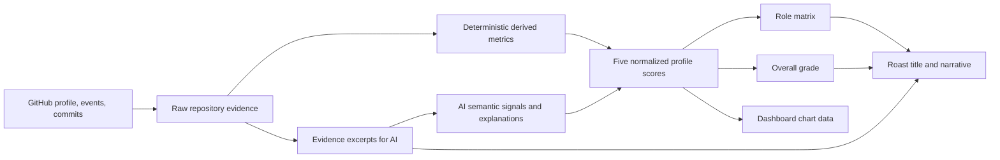

# Dashboard Profile Scoring

## Purpose

The dashboard profile is a structured read of a GitHub repository. It is not
the same thing as the roast intensity or the leaderboard score. Every visible
dashboard card must be derived from one evidence-backed assessment so that a
role such as `Big-Bang Committer` can be understood from the same commit
patterns shown in the charts.

The first real-user exploration target is `lafllamme`. Until the production
pipeline is connected, the dashboard uses explicit mock fixtures that follow
this contract.

## Category status

| Category | Status | Score owner | AI role |
| --- | --- | --- | --- |
| Safety | v1 implemented and validated | deterministic server formula | classify grounded introduced risks only |
| Workflow | v1 implemented and first-pass validated | deterministic server formula | optional explanation, no numeric score |
| Clarity | v1 implemented and first-pass validated | deterministic server formula | optional patch-level explanation later |
| Complexity | v1 implemented and first-pass validated | deterministic server formula | GitHub-observable change-surface proxy |
| Context | v1 implemented and first-pass validated | deterministic server formula | optional content explanation later |

Safety, Workflow, Clarity, Context, and Complexity now have documented scoring
rules in the current live slice. The combined AI second-review contract,
payload budget, and repository-first collection are documented in
[Dashboard AI Review](./dashboard-ai-review.md). The overall grade and role
matrix remain exploratory until the category rules have been calibrated against
a larger, repository-aware evidence window.

## Source-of-truth pipeline



The server owns the pipeline. The client renders the resulting assessment and
does not independently infer a role or grade.

## Existing API boundary

The current roast pipeline already fetches:

- the GitHub user profile;
- public activity events;
- enriched commit details;
- commit-level file changes, additions, deletions, and patches;
- pull-request references.

The current public response exposes `meta`, `metrics`, `feedback`, and roast
content. Its `metrics` object is the existing roast/leaderboard model:
`spaghettiIndex`, `stinkScore`, `egoDamage`, `grade`, and `specialTitle`.

That model remains compatible for existing roast and leaderboard consumers. The
dashboard requires a separate `DashboardProfileAssessment` contract rather
than reusing those values.

## Dashboard evidence model

The current server-owned core assessment shape is intentionally separate from
the optional AI review contract:

```ts
interface DashboardProfileAssessment {
  version: 'v1'
  username: string
  scores: Record<'clarity' | 'safety' | 'workflow' | 'complexity' | 'context', number>
  overallScore: number
  grade: string
  role: DashboardProfileRole
  roleCandidates: DashboardProfileRole[]
  roleStatus: 'classified' | 'unclassified'
  confidence: number
  derivedMetrics: DashboardDerivedMetrics
  aiAdjustments: Partial<Record<'clarity' | 'safety' | 'workflow' | 'complexity' | 'context', number>>
  evidenceWindow: {
    commitCount: number
    pullRequestCount: number
    source: 'github-public-activity' | 'github-repository-evidence'
    from?: string
    to?: string
  }
}
```

Any evidence reference in an axis contract must point to collected commits,
files, pull requests, or derived metric identifiers. The AI may explain or
boundedly refine a score, but it must not cite evidence that was not fetched.

The dashboard endpoint now uses the repository-first collector and one combined
AI review. The complete request and patch limits are recorded in
[Dashboard AI Review](./dashboard-ai-review.md); this keeps the five category
prompts from drifting apart and prevents the Cloudflare payload from growing
with every new axis.

## Evidence policy: neutral fallback

The general rule for incomplete or misleading public samples is recorded in
[Neutral score for insufficient evidence](../decisions/active/neutral-score-for-insufficient-evidence.md).
If a category does not have enough category-specific evidence for a reliable
judgment, the deterministic score is `50`. This is a neutral **not enough
evidence** value, not an average-quality claim. Missing tests, CI, PRs,
documentation, or patch excerpts do not become negative evidence by
themselves; confirmed risks can still lower a score where that category's
contract permits it.

The eventual dashboard response should expose an evidence status alongside the
number, for example `scored` versus `insufficient-evidence`. Until that status
is part of the API, the score and the sample limitation must remain visible in
the surrounding UI/copy. Role resolution must keep profiles without minimum
evidence `Unclassified` rather than assigning a role from a neutral fallback.

## Derived metrics

The first deterministic feature set should include:

| Metric | Main axes | Meaning |
| --- | --- | --- |
| commit frequency | Workflow | Commits per selected time window |
| commit size average | Complexity, Workflow evidence | Typical additions/deletions per commit |
| commit size median / p90 / max | Complexity, Workflow evidence | Typical size, upper-tail size, and largest observed change |
| commit size variance | Workflow evidence, Complexity | Whether work arrives steadily or in bursts |
| files per commit | Complexity, Clarity | Breadth of each change set |
| non-merge workflow commits | Workflow | Personal delivery sample after merge commits are excluded |
| workflow average files per commit | Workflow | Primary reviewability/granularity signal |
| workflow conventional message ratio | Clarity, Workflow evidence | Share of personal commits with an explicit conventional subject |
| workflow outlier ratio | Workflow | Relative size/scope outliers within the non-merge sample |
| clarity scope signal | Clarity | Reviewable change breadth from personal commits |
| context documentation signal | Context | Small positive signal when documentation files are visibly changed |
| complexity scope signal | Complexity | Control of the average personal files-per-commit surface |
| complexity outlier signal | Complexity | Share of personal commits that are not relative size/scope outliers |
| complexity churn signal | Complexity | Weak signal for unusually deletion-heavy personal changes |
| additions/deletions ratio | Safety, Complexity | Churn and rework pressure |
| message structure | Workflow, Context | Specificity and information density of commit messages |
| file-type distribution | Context, Clarity | Presence of tests, docs, configuration, and source |
| documentation signal | Context | README, Markdown, inline explanations, and project orientation |
| safety signal | Safety | Tests, validation, error paths, and boundary handling in sampled patches |
| hotspot concentration | Complexity | Repeated changes in the same files or directories |

### Validated rule: commit size

Commit size remains a factual metric and enters Complexity only indirectly
through the relative outlier signal. It is calculated per enriched commit as:

```text
commitSize = additions + deletions
```

The scorer exposes four views of the observed sizes:

| Value | Meaning |
| --- | --- |
| average | arithmetic mean across sampled commits |
| median | typical commit size, less sensitive to outliers |
| p90 | upper-tail size of the sample |
| maximum | largest observed commit |

This separation is intentional. A single large release or merge commit must
not automatically define a developer's entire Workflow or Complexity score.
The current unit scenarios cover a small, medium, and large commit and assert
that the median remains distinct from the average and maximum. Complexity does
not use the raw average or maximum as a direct quality penalty, because one
release commit must not define the developer's whole profile.

Every future metric should follow the same record: definition, formula, score
ownership, validation examples, and known limitations.

### Merge and integration policy

Merge commits are collected but treated as `integration` evidence, not as
personal work. They can remain visible in raw repository activity and merge
volume, but they are excluded from Clarity, Workflow, Complexity, Context, and
Safety scoring. This protects merge-heavy maintainer profiles from being ranked
on changes that are not attributable to them. The pull-request denominator
must likewise use personal commits. See the active
[merge-commit decision](../decisions/active/merge-commits-as-integration-evidence.md)
for the rationale. The dashboard collector now applies the same personal-commit
filter to Safety as well.

## Cross-profile validation log

Every metric is checked against the same six real GitHub profiles before it
is allowed to influence a final category score:

| Profile | Why it is useful as a check |
| --- | --- |
| `danielroe` | high-volume, active framework maintainer profile |
| `torvalds` | large systems repository with merge-heavy history |
| `lafllamme` | current product user and smaller project context |

These comparisons are sanity checks, not rankings of developer ability. The
legacy tables below were produced from the earlier event-based collector, which
sampled up to 12 enriched public commits. The live dashboard path now uses the
repository-first budget documented in [Dashboard AI Review](./dashboard-ai-review.md),
so those historical values are not API snapshots.

### Current metric results

| Metric | Formula / rule | danielroe | torvalds | lafllamme | Used for | Current confidence |
| --- | --- | ---: | ---: | ---: | --- | --- |
| average commit size | `(additions + deletions)` averaged per commit | 112 | 4,046 | 236 | Workflow, Complexity | medium |
| median commit size | 50th percentile of commit sizes | 58 | 680 | 40 | Workflow, Complexity | medium |
| p90 commit size | 90th percentile of commit sizes | 290 | 6,331 | 462 | Workflow, Complexity | medium |
| largest commit | maximum `additions + deletions` | 319 | 32,421 | 1,202 | outlier check | medium |
| active days | unique UTC calendar days with commits | 3 | 5 | 5 | Workflow | low/medium |
| span days | inclusive days from first to last sampled commit | 3 | 5 | 7 | Workflow | low/medium |
| commits per 30 days | `commitCount / spanDays * 30` | 120 | 72 | 51.4 | Workflow | low/medium |
| message quality | subject specificity, action words, conventional prefix | 95 | 68 | 87 | Clarity, Context | medium |
| conventional messages | conventional subjects / commits | 100% | 0% | 75% | Clarity, Workflow | medium |
| generic messages | generic subjects / commits | 0% | 0% | 0% | Clarity | medium |
| test-file ratio | test-like changed files / changed files | 21% | 2% | 0% | Safety evidence only | low |
| CI-file ratio | CI files / changed files | 11% | 0% | 0% | Safety evidence only | low |
| validation-file ratio | validator/schema/guard files / changed files | 0% | 0% | 0% | Safety evidence only | low |
| PR coverage | `min(1, pullRequests / commits) * 100` | 50% | 0% | 0% | Safety, Workflow evidence | low/medium |
| deletion ratio | `deletions / (additions + deletions) * 100` | 31% | 15% | 14% | Safety, Complexity evidence | medium |

The current Safety comparison exposes a limitation rather than a conclusion:
`0% test-file ratio` for `lafllamme` means that no test file appeared in the
sampled changed files. It does not mean that the repository has no tests. The
same applies to CI and validation files. These signals must remain evidence
until repository-wide metadata or patch-level AI analysis is available.

The current practical conclusion is therefore:

```text
Commit size and message quality are usable first-order signals.
Commit frequency is useful only with a visible sample window.
Changed test/CI files are weak Safety evidence and must not dominate the score.
```

#### Historical Safety v0 calibration

The former heuristic was run against a broader public sample. These values are
kept only as a calibration record; they are not used by the current scorer:

| Profile | Safety v0 | Confidence | Interpretation |
| --- | ---: | ---: | --- |
| `lafllamme` | 66 | 60% | small project sample with little explicit Safety evidence |
| `danielroe` | 72 | 60% | PR, test, CI, and defensive patch signals visible |
| `torvalds` | 65 | 60% | large kernel changes, but the sample exposes few classified Safety signals |
| `sindresorhus` | 73 | 60% | moderate defensive and workflow evidence in the sample |
| `antfu` | 71 | 60% | moderate defensive evidence with limited PR/test evidence |
| `kentcdodds` | 81 | 60% | strongest visible combination of review and defensive signals in this run |

This is a calibration set, not a ranking of developer ability. The result is
useful because it produces a bounded spread without awarding 100 by default;
it also shows why Safety must remain separate from overall engineering quality.

### Safety v1: implemented rule

Safety is now server-owned and reproducible. It starts at 65 and combines
visible defensive evidence with deliberately weak process signals:

```text
Safety = 65
  + defensivePatchRatio * 0.20
  + testFileRatio * 0.15
  + ciFileRatio * 0.15
  + validationFileRatio * 0.10
  + pullRequestCoverage * 0.10
  - confirmedRiskPenalty
```

All ratios in this formula are percentages from `0` to `100`. Missing tests,
CI, pull requests, or patch excerpts do not create a risk. They simply cannot
raise the score. `riskyFileRatio` remains context information and is never a
penalty.

The only permitted penalties are:

| Confirmed signal | Penalty |
| --- | ---: |
| introduced low-severity risk | 5 |
| introduced medium-severity risk | 15 |
| introduced high-severity risk | 30 |
| introduced exposed secret or auth bypass | 50 |

Only `verdict: "risk"` together with `impact: "introduced"` is eligible. A
fixed bug, an unclear excerpt, a missing safeguard, or a signal for a commit
outside the supplied sample is ignored. If no usable patch exists at all, the
Safety score is `50` with low AI confidence rather than a fabricated ranking.

#### AI second review

The former Safety-only three-commit request is superseded by the combined
contract in [Dashboard AI Review](./dashboard-ai-review.md). One bounded patch
sample now covers all five axes. The AI remains an evidence classifier, not a
scorer: the server validates exact SHA/filename anchors, converts only grounded
introduced Safety risks into the existing severity penalty, and allows only
bounded non-safety adjustments after sufficient evidence. The old AI `score`,
findings, and category-gap calculation are retired.

Role resolution is a separate deterministic step. It evaluates every matching
rule in the matrix, keeps all matches in `roleCandidates`, and uses stable
rule priority for `role`. At least three commits and one usable patch are
required; otherwise the result is `Unclassified` with `roleStatus:
"unclassified"`.

#### Synthetic validation cases

The rule is covered by deterministic scenarios before real profiles are
ranked:

| Scenario | Expected result | Current result |
| --- | --- | ---: |
| defensive validation/error-handling patch with tests, CI, and PR | clearly above 80 | 100 |
| ordinary feature patch without Safety evidence | normal middle range | 65 |
| introduced medium-risk `innerHTML` signal | below the baseline | 50 |
| introduced high-risk auth bypass | clearly below 50 | 15 |
| fixed OOB/leak signal | no AI penalty | 65 |
| no usable patch evidence | fallback, low confidence | 50 |

These numbers validate direction and boundaries, not a developer ranking.

#### Repository-first six-profile calibration

The agreed public test set was run through `POST /api/dashboard-profile` after
the v1 implementation. Every request returned HTTP 200. The Qwen response was
valid for five profiles; one response was marked invalid and therefore made no
AI adjustment. No ungrounded introduced-risk signal was accepted in this run.

| Profile | Safety v1 | Overall | Grade | Role | AI status | Patch files | Accepted introduced risks |
| --- | ---: | ---: | --- | --- | ---: | ---: | ---: |
| `lafllamme` | 66 | 81 | B+ | Human Compiler | assessed | 12 | 0 |
| `danielroe` | 71 | 82 | B+ | Dependency Detective | invalid-response | 3 | 0 |
| `torvalds` | 65 | 62 | C | Unclassified | assessed | 6 | 0 |
| `sindresorhus` | 69 | 61 | C | Unclassified | assessed | 12 | 0 |
| `antfu` | 67 | 82 | B+ | Human Compiler | assessed | 8 | 0 |
| `kentcdodds` | 72 | 51 | D+ | Vibe Coder | assessed | 6 | 0 |

This run validates the contract and confirms that the server no longer trusts
an AI-provided number. It is still a bounded sample of public activity, not a
claim about overall developer ability.

#### Qwen response contract

The combined review ends with `/no_think` for the configured Qwen model. The
OpenAI-compatible endpoint can still return a reasoning-only response with an
empty `message.content`. The server may recover a strict review object from
that channel only when it passes the same JSON contract, exact SHA/filename
grounding, and safety validation; free-form reasoning is never exposed or
treated as evidence. If no valid object exists, the result is
`invalid-response` and the deterministic score remains authoritative.

### Validation in progress: commit frequency

Commit frequency is measured against the observed commit dates, not against
the number of returned GitHub events alone:

```text
activeDays = unique UTC calendar days containing a commit
spanDays = inclusive days between the first and last commit
commitsPer30Days = commitCount / spanDays * 30
```

The metric is currently displayed as evidence and is not yet a Workflow score
input. A short GitHub sample can make the normalized rate look high, so the
analysis window and sample limit must remain visible while validating it.

### Clarity v1: implemented rule

Clarity v1 measures whether the sampled personal work communicates intent in
understandable, reviewable slices. It deliberately does not claim to measure
variable naming or the readability of code internals; those require patch-level
evidence and can be added as a later AI explanation layer.

```text
Clarity = workflowMessageQuality * 0.55
        + workflowConventionalMessageRatio * 0.15
        + clarityScopeSignal * 0.30

clarityScopeSignal = 100 - max(0, workflowAverageFilesPerCommit - 1) * 7
```

`workflowMessageQuality` scores the first line of non-merge commit messages by
specificity, action language, and conventional prefixes. Generic subjects such
as `update` or `stuff` score low. `workflowConventionalMessageRatio` reports
the explicit prefix share separately so the dashboard can explain the result.
`clarityScopeSignal` uses the average changed-file count from the same personal
sample; it is a proxy for how easy a change is to understand, not a code-quality
verdict.

Clarity requires at least three sampled commits and three non-merge commits.
Merge-only or integration-heavy samples return the neutral `50` fallback under
the [evidence policy](../decisions/active/neutral-score-for-insufficient-evidence.md).
The score is deterministic. A future unified AI request may inspect bounded
patch excerpts to explain or qualify the result, but it must not replace or
override the number.

This is a clarity/context signal, not proof of code quality. A well-written
message can describe a bad change, so patch-level and repository signals must
remain separate.

#### Clarity validation cases

| Scenario | Expected result | Current result |
| --- | --- | ---: |
| three small, explicit, conventional personal commits | clearly good | `>85` |
| three generic messages across broad changes | clearly weak | `<35` |
| one or two personal commits only | neutral, insufficient sample | `50` |
| merge-only or integration-heavy sample | neutral, not a personal failure | `50` |

### Context v1: implemented rule

Context v1 measures whether the sampled work explains itself and leaves enough
orientation for the next person. It uses only evidence present in the public
payload: personal commit intent, visible documentation changes, and pull-request
coverage. It does not claim that a repository has no README or comments merely
because those files did not change in the sampled window.

```text
Context = workflowMessageQuality * 0.50
        + contextDocumentationSignal * 0.30
        + contextReviewSignal * 0.20

contextDocumentationSignal = 50, when no documentation file is visible
                           = 50 + min(documentationFileRatio * 2, 30), otherwise
contextReviewSignal = pullRequestCoverage, when PR evidence exists
                    = 50, otherwise
```

The same minimum evidence gate applies as for Clarity: at least three sampled
commits and three non-merge commits. Documentation and PR absence are neutral,
not penalties. A visible documentation change can raise the result only within
the deliberately capped `50–80` documentation signal range. The deterministic
score is the source of truth; a future unified AI request may explain the
content of bounded README, Markdown, or patch excerpts but must not override
the number.

#### Context validation cases

| Scenario | Expected result | Current result |
| --- | --- | ---: |
| explicit personal commits, visible docs, and PR evidence | clearly good | `>75` |
| explicit personal commits without visible docs or PRs | above neutral, not penalized | `>50` |
| vague personal messages without docs or PRs | clearly weak | `<45` |
| fewer than three personal commits | neutral, insufficient sample | `50` |

### Complexity v1: implemented rule

Complexity v1 measures **complexity control of the observed change surface**.
GitHub's public payload does not expose an AST, call graph, cyclomatic
complexity, or reliable duplication count, so this version does not pretend to
measure those things. It evaluates only personal, non-merge commits and keeps
the three signals explicit:

```text
Complexity = complexityScopeSignal * 0.55
           + complexityOutlierSignal * 0.30
           + complexityChurnSignal * 0.15

complexityScopeSignal = clamp(100 - max(0, averagePersonalFiles - 2) * 6)
complexityOutlierSignal = 100 - personalRelativeOutlierRatio
complexityChurnSignal = clamp(100 - max(0, personalDeletionRatio - 50) * 0.5)
```

`complexityScopeSignal` is the main signal: a typical personal change that
touches one or two files stays strong, while broad change surfaces reduce the
score gradually. `complexityOutlierSignal` uses the existing relative
size/scope outlier rule rather than a global line-count threshold. The churn
signal is deliberately weak; a deletion-heavy refactor is not automatically a
complexity failure. Merge commits are excluded before all three signals are
calculated, so integration breadth cannot lower the score.

The same evidence gate as Clarity and Context applies: fewer than three total
commits or fewer than three personal non-merge commits returns neutral `50`.
That is an insufficient-evidence result, not a claim that the developer has
poor complexity control. AI may later explain bounded patch evidence such as
deep nesting, duplicated branches, or unnecessary indirection in the unified
request, but it must not replace this deterministic number.

#### Complexity validation cases

| Scenario | Expected result | Current result |
| --- | --- | ---: |
| four focused personal commits touching one or two files | clearly good | `>80` |
| four broad personal commits touching many files | clearly weak | `≤45` |
| focused personal history plus huge merge commits | same as personal history | equal |
| fewer than three personal commits | neutral, insufficient sample | `50` |
| deletion-heavy refactor without broad scope | not automatically bad | weak influence only |

### Supporting Safety evidence metrics

The supporting Safety metrics report observable safeguards. They feed the weak
positive terms in Safety v1, but they never become a risk verdict by
themselves:

```text
testFileRatio = test-like changed files / changed files
ciFileRatio = CI configuration files / changed files
validationFileRatio = validator/schema/guard files / changed files
pullRequestCoverage = min(1, pullRequests / commits) * 100
deletionRatio = deletions / (additions + deletions) * 100
```

These signals remain intentionally weak. A missing test file in a small public
sample does not prove that a repository has no tests, and a CI file change does
not prove that CI passes. Actual deductions come only from the validated AI
signal contract and its introduced-risk rules above.

### Workflow v1: implemented rule

Workflow measures delivery hygiene: whether changes arrive in understandable,
reviewable slices with traceable intent. It does not reward raw output volume,
and it does not treat a high commit frequency or maintainer merge stream as
proof of quality.

```text
Workflow = workflowMessageQuality * 0.45
         + workflowGranularityScore * 0.40
         + workflowReviewSignal * 0.15

workflowGranularityScore = fileScopeSignal * 0.75
                         + outlierSignal * 0.25
fileScopeSignal = 100 - max(0, workflowAverageFilesPerCommit - 1) * 7
outlierSignal = 100 - workflowLargeCommitRatio
```

All inputs are percentages from `0` to `100` and the result is clamped to the
same range. The terms mean:

- `workflowMessageQuality`: the existing first-line score, but calculated
  only across non-merge commits;
- `workflowAverageFilesPerCommit`: average changed-file count across those
  non-merge commits; this is the primary granularity signal and is independent
  of repository line-count scale;
- `workflowLargeCommitRatio`: the share of non-merge commits that are outliers
  against the profile's own typical size (`4x` median size or at least `500`
  changed lines, or `4x` median file count or at least `15` files);
- `workflowReviewSignal`: `pullRequestCoverage` when any PR evidence exists,
  otherwise neutral `50` because public activity can omit review events.

Merge commits are excluded from the personal workflow signals. If the sample
contains only merge commits, Workflow falls back to neutral `50` and the merge
ratio remains available as chart/context evidence. With no commits, Workflow
also falls back to `50`. Commit frequency, active days, and span days remain
factual chart evidence and are not score inputs: this prevents a compressed
burst from outranking a steadier history solely because it contains more
commits per 30-day normalization.

This is an evidence fallback, not a quality claim. The merge-only case is
evidence-limited and must not be interpreted as an average Workflow result for
the person behind the repository.

AI is not required to calculate Workflow v1. The inputs are observable in the
GitHub payload and the deterministic result is reproducible. A future unified
dashboard AI request may provide a short explanation or flag an ambiguous
commit, but it must not replace or override this formula.

#### Workflow validation cases

| Scenario | Expected result | Current result |
| --- | --- | ---: |
| small, explicit, non-merge commits with PR coverage | clearly good | `>90` |
| large, merge-heavy commits with generic messages | clearly weak | `<40` |
| merge-only maintainer/integration history | neutral, not a personal failure | `50` |
| same history compressed onto one day vs spread over three days | identical Workflow score | identical |

These cases validate the direction of the formula. They do not claim that a
large systems repository is poorly engineered; they only describe the sampled
delivery pattern under this narrow Workflow lens.

Raw GitHub counts remain factual. Scores are normalized projections of these
metrics and must carry a scoring-version identifier.

## Score ownership

Deterministic code should own:

- counting and normalization;
- score bounds (`0–100`);
- overall-score calculation;
- grade calculation;
- role-matrix eligibility;
- chart aggregation.

The AI should own:

- semantic interpretation of sampled code and commit messages;
- short explanations for each axis;
- roast wording and constructive feedback.

For the Safety axis, the AI returns only the constrained signals documented
above. It never returns a score, and it cannot override GitHub facts or the
grade formula. Other semantic axes may later receive their own versioned
contracts; they must not be mixed into Safety v1 implicitly.

## Grade and role rules

The overall score is the arithmetic mean of the five normalized axes. The
grade bands are documented in [profiles.md](./profiles.md) and are applied by
one server-side function. A role describes a dominant pattern; it is not a
replacement for the overall grade.

For example, `Big-Bang Committer` should be supported by low workflow quality,
large or irregular change sets, and a high per-commit file/change footprint.
`Git Gardener` should show the inverse pattern: many smaller, reviewable,
more evenly distributed commits. The role, charts, and roast must all point to
the same evidence.

Safety role checks use the v1 boundaries from the role matrix: `Edge-Case
Sheriff` requires Safety `≥85`, `Risk Runner` stays in `40–60`, and `Finger
Crosser` requires Safety `≤35`. Profiles without enough evidence are
`Unclassified` rather than force-ranked.

## Dashboard mapping

| Dashboard surface | Assessment source |
| --- | --- |
| Radar / Ring | Five normalized axis scores |
| Verdict | Grade, primary role, headline, and AI explanation |
| Evidence | Raw window totals plus axis evidence |
| Commit Frequency | Deterministic commit count and selected time window |
| Commit Rhythm | Commit distribution and size over time |
| Change Volume | Additions, deletions, and churn per commit |
| Repository Anatomy | File/directory change aggregation and hotspots |

No chart should generate an unrelated random value. Mocks may simulate a
pattern, but each value must be traceable to the profile axes and the same
evidence model.

## Current implementation

The first live slice is available at `POST /api/dashboard-profile` with a
body of `{ "username": "lafllamme" }`. It calls the repository-first GitHub
collector, derives the metrics above, runs one bounded combined AI review, and
returns a versioned assessment in memory. Workflow v1, Clarity v1, Context v1,
and Complexity v1 are calculated in the same pass from the collected commit
metadata; the AI can only provide the documented second-review adjustments.
The dashboard page exposes this through its
`Analyze live` control while keeping the mock profile selector available for
comparison. Safety v1 lives in `server/roast/dashboard-profile-scoring.ts`,
with deterministic commit selection in
`server/roast/dashboard-patch-selection.ts` and the AI adapter in
`server/roast/dashboard-ai-scoring.ts`. Role matching lives in
`server/roast/dashboard-profile-roles.ts` and never runs without the minimum
evidence gate. The endpoint also returns repository, check-run, collection, and
AI review metadata so the UI can show how much evidence was actually available.

The rule layer is covered by synthetic scenarios for small documented work,
large merge-heavy commits, and an empty GitHub result. These scenarios are
deliberately assertions about direction and bounds, not snapshots of a user's
grade, so the model can be tuned without hiding regressions.

#### Historical event-based Clarity calibration

The six agreed comparison profiles were run through the same live endpoint
after Clarity v1 was implemented. These are deterministic results from the
current public activity sample, not hand-tuned expectations:

| Profile | Commits | Personal commits | Message quality | Conventional | Avg. files | Scope signal | Clarity v1 |
| --- | ---: | ---: | ---: | ---: | ---: | ---: | ---: |
| `lafllamme` | 12 | 11 | 88 | 82% | 8.3 | 49 | **75** |
| `danielroe` | 12 | 12 | 92 | 92% | 3.7 | 81 | **89** |
| `torvalds` | 12 | 1 | 76 | 0% | 4.0 | 79 | **50** |
| `sindresorhus` | 12 | 12 | 59 | 0% | 28.6 | 0 | **32** |
| `antfu` | 12 | 12 | 89 | 100% | 14.0 | 9 | **67** |
| `kentcdodds` | 4 | 4 | 74 | 25% | 5.8 | 67 | **65** |

The result is directionally useful but deliberately narrow. `danielroe` has a
strong sampled intent signal, `lafllamme` lands in the middle, and `torvalds`
is correctly neutral because only one personal commit survived merge filtering.
`sindresorhus` is pulled down by several vague maintenance subjects and a
300-file dependency update; that is a warning about this sampled delivery
window, not a claim that the developer's complete codebase lacks clarity.
The role matrix must remain provisional until the other axes and evidence
statuses can prevent such sample-local signals from becoming a full profile
verdict.

#### Historical event-based Context calibration

The same six profiles were run through the endpoint after Context v1 was
implemented. These are deterministic results from the current public activity
sample, not hand-tuned expectations:

| Profile | Commits | Personal commits | Message quality | Docs ratio | Docs signal | PR coverage | Context v1 |
| --- | ---: | ---: | ---: | ---: | ---: | ---: | ---: |
| `lafllamme` | 12 | 11 | 88 | 3% | 56 | 0% | **71** |
| `danielroe` | 12 | 12 | 90 | 10% | 70 | 50% | **76** |
| `torvalds` | 12 | 1 | 76 | 0% | 50 | 0% | **50** |
| `sindresorhus` | 12 | 12 | 59 | 13% | 76 | 50% | **62** |
| `antfu` | 12 | 12 | 89 | 41% | 80 | 50% | **79** |
| `kentcdodds` | 4 | 4 | 74 | 8% | 66 | 100% | **77** |

The spread is intentionally modest because documentation and PR signals are
weak evidence in a public commit sample. `torvalds` remains neutral under the
same three-personal-commit gate. The result is a context-of-the-sample signal,
not proof that a repository has or lacks complete documentation.

#### Historical event-based Complexity calibration

The same six profiles were run through the endpoint after Complexity v1 was
implemented. These values measure the observed personal change surface, not
the intrinsic difficulty of the projects or the total skill of their authors:

| Profile | Commits | Personal commits | Avg. personal files | Outlier signal | Churn signal | Complexity v1 |
| --- | ---: | ---: | ---: | ---: | ---: | ---: |
| `lafllamme` | 12 | 11 | 8.3 | 91 | 100 | **76** |
| `danielroe` | 12 | 12 | 4.8 | 83 | 100 | **86** |
| `torvalds` | 12 | 1 | 4.0 | 100 | 99 | **50** |
| `sindresorhus` | 12 | 12 | 28.6 | 75 | 100 | **38** |
| `antfu` | 12 | 12 | 14.0 | 58 | 100 | **48** |
| `kentcdodds` | 4 | 4 | 5.8 | 100 | 100 | **88** |

The direction is plausible for this bounded sample: focused personal changes
score higher, broad sampled changes score lower, and `torvalds` is neutral
because only one personal commit is available. `sindresorhus` and `antfu` are
not being declared poor developers; their sampled change surface is simply
broad under this proxy. This is the point at which a future repository-aware
AST/dependency analysis could add evidence without changing the v1 contract.

#### Historical event-based Workflow calibration

The agreed comparison profiles were run through the same live endpoint after
Workflow v1 was implemented. The values below are the deterministic result of
the current public activity sample, not hand-tuned expectations:

| Profile | Commits | Workflow commits | Message quality | Avg. files | Workflow outliers | Merge commits | PR coverage | Workflow v1 |
| --- | ---: | ---: | ---: | ---: | ---: | ---: | ---: | ---: |
| `lafllamme` | 12 | 11 | 88 | 8.3 | 9% | 8% | 0% | **71** |
| `danielroe` | 12 | 12 | 94 | 1.9 | 0% | 0% | 50% | **88** |
| `torvalds` | 12 | 0 | 50 | 0.0 | 50% neutral | 100% | 0% | **50** |

The result is directionally useful: `danielroe` shows the cleanest sampled
delivery pattern, `lafllamme` lands in a solid middle-high range, and the
`torvalds` sample is dominated by merge commits. The last result is not a
claim about engineering ability or code quality; it is a reminder that
Workflow measures the shape of the sampled delivery history. The collector's
12-commit public window can overrepresent a particular integration phase.

## Phased implementation

1. Define and test the shared `DashboardProfileAssessment` contract. **Done**
2. Build a pure feature-extraction layer over `GithubContext`. **Done**
3. Add deterministic normalization and score calculation. **Done for all five v1 axes**
4. Add the constrained combined AI second-review step with evidence-grounded penalties and bounded refinements. **Done**
5. Add the role resolver and grade resolver using the documented matrix. **Done**
6. Map the assessment to the existing dashboard fixture shape. **Done**
7. Run the pipeline against the six-profile calibration set without persistence. **Done; repository-first calibration recorded above**
8. Compare the real result with the mock stories and only then design database
   storage and caching.

Persistence is deliberately deferred. The assessment must first be correct,
inspectable, and versioned in memory and in the response contract.

Persistence is intentionally deferred while the scoring model is being
explored. The first implementation runs entirely in memory against real GitHub
evidence and exposes the assessment for inspection. A future database design
must be additive and versioned, but no migration is committed until the score
model and response contract have been validated with real users and test
scenarios.

## Current implementation gaps

- The existing roast scoring model still uses the older roast metrics and grade
  vocabulary; it must not be treated as the dashboard profile score.
- The six-profile run is a bounded calibration check; broader historical data
  is still needed before role thresholds are treated as production rankings.
- The dashboard mock still contains an unused `dashboard.commits` branch.
- The current mock uses synthetic data generation; the profile-index seed must
  never influence production-like totals.
- The current line chart combines commits and additions visually; a final
  implementation needs separate scales or a clearer presentation.
