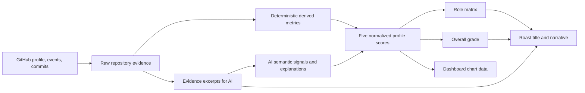

# Dashboard Profile Scoring

## Purpose

The dashboard profile is a structured read of a GitHub repository. It is not
the same thing as the roast intensity or the leaderboard score. Every visible
dashboard card must be derived from one evidence-backed assessment so that a
role such as `Big-Bang Committer` can be understood from the same commit
patterns shown in the charts.

The first real-user exploration target is `lafllamme`. Until the production
pipeline is connected, the dashboard uses explicit mock fixtures that follow
this contract.

## Source-of-truth pipeline



The server owns the pipeline. The client renders the resulting assessment and
does not independently infer a role or grade.

## Existing API boundary

The current roast pipeline already fetches:

- the GitHub user profile;
- public activity events;
- enriched commit details;
- commit-level file changes, additions, deletions, and patches;
- pull-request references.

The current public response exposes `meta`, `metrics`, `feedback`, and roast
content. Its `metrics` object is the existing roast/leaderboard model:
`spaghettiIndex`, `stinkScore`, `egoDamage`, `grade`, and `specialTitle`.

That model remains compatible for existing roast and leaderboard consumers. The
dashboard requires a separate `DashboardProfileAssessment` contract rather
than reusing those values.

## Dashboard evidence model

The proposed server-owned assessment shape is:

```ts
interface DashboardProfileAssessment {
  version: string
  username: string
  axes: {
    clarity: ProfileAxisAssessment
    safety: ProfileAxisAssessment
    workflow: ProfileAxisAssessment
    complexity: ProfileAxisAssessment
    context: ProfileAxisAssessment
  }
  overallScore: number
  grade: string
  primaryRole: string
  secondaryRoles: string[]
  confidence: number
  evidenceWindow: {
    commitCount: number
    pullRequestCount: number
    fileCount: number
    additions: number
    deletions: number
  }
}

interface ProfileAxisAssessment {
  score: number
  confidence: number
  evidenceRefs: string[]
  explanation: string
}
```

`evidenceRefs` must point to collected commits, files, pull requests, or
derived metric identifiers. The AI may explain a score, but it must not cite
evidence that was not fetched.

## Derived metrics

The first deterministic feature set should include:

| Metric | Main axes | Meaning |
| --- | --- | --- |
| commit frequency | Workflow | Commits per selected time window |
| commit size average | Workflow, Complexity | Typical additions/deletions per commit |
| commit size variance | Workflow, Complexity | Whether work arrives steadily or in bursts |
| files per commit | Complexity, Clarity | Breadth of each change set |
| additions/deletions ratio | Safety, Complexity | Churn and rework pressure |
| message structure | Workflow, Context | Specificity and information density of commit messages |
| file-type distribution | Context, Clarity | Presence of tests, docs, configuration, and source |
| documentation signal | Context | README, Markdown, inline explanations, and project orientation |
| safety signal | Safety | Tests, validation, error paths, and boundary handling in sampled patches |
| hotspot concentration | Complexity | Repeated changes in the same files or directories |

Raw GitHub counts remain factual. Scores are normalized projections of these
metrics and must carry a scoring-version identifier.

## Score ownership

Deterministic code should own:

- counting and normalization;
- score bounds (`0–100`);
- overall-score calculation;
- grade calculation;
- role-matrix eligibility;
- chart aggregation.

The AI should own:

- semantic interpretation of sampled code and commit messages;
- evidence selection from the supplied payload;
- short explanations for each axis;
- roast wording and constructive feedback.

For semantic axes, the AI can return a constrained signal with `score`,
`confidence`, `evidenceRefs`, and `explanation`. The server validates the
shape, clamps or rejects invalid values, and combines the signal with the
deterministic feature score. The AI never receives permission to override
GitHub facts or the grade formula.

## Grade and role rules

The overall score is the arithmetic mean of the five normalized axes. The
grade bands are documented in [profiles.md](./profiles.md) and are applied by
one server-side function. A role describes a dominant pattern; it is not a
replacement for the overall grade.

For example, `Big-Bang Committer` should be supported by low workflow quality,
large or irregular change sets, and a high per-commit file/change footprint.
`Git Gardener` should show the inverse pattern: many smaller, reviewable,
more evenly distributed commits. The role, charts, and roast must all point to
the same evidence.

## Dashboard mapping

| Dashboard surface | Assessment source |
| --- | --- |
| Radar / Ring | Five normalized axis scores |
| Verdict | Grade, primary role, headline, and AI explanation |
| Evidence | Raw window totals plus axis evidence |
| Commit Frequency | Deterministic commit count and selected time window |
| Commit Rhythm | Commit distribution and size over time |
| Change Volume | Additions, deletions, and churn per commit |
| Repository Anatomy | File/directory change aggregation and hotspots |

No chart should generate an unrelated random value. Mocks may simulate a
pattern, but each value must be traceable to the profile axes and the same
evidence model.

## Phased implementation

1. Define and test the shared `DashboardProfileAssessment` contract.
2. Build a pure feature-extraction layer over `GithubContext`.
3. Add deterministic normalization and score calculation.
4. Add the role resolver and grade resolver using the documented matrix.
5. Add a constrained AI semantic-assessment step with evidence references.
6. Map the assessment to the existing dashboard fixture shape.
7. Run the pipeline against `lafllamme` without persistence.
8. Compare the real result with the mock stories and only then design database
   storage and caching.

Persistence is deliberately deferred. The assessment must first be correct,
inspectable, and versioned in memory and in the response contract.

## Current known migration gaps

- The existing roast scoring model still uses the older roast metrics and grade
  vocabulary; it must not be treated as the dashboard profile score.
- The dashboard mock still contains an unused `dashboard.commits` branch.
- The current mock uses synthetic data generation; the profile-index seed must
  never influence production-like totals.
- The current line chart combines commits and additions visually; a final
  implementation needs separate scales or a clearer presentation.
