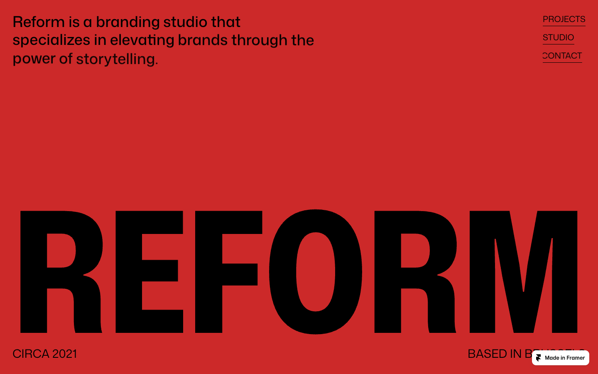
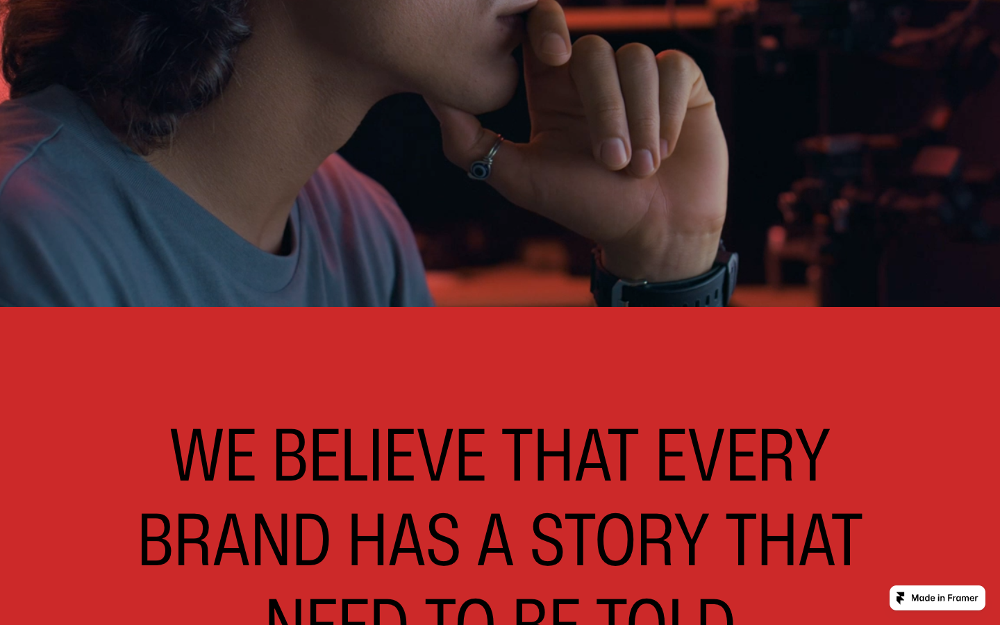

# 01: Reform Studio

Source: https://reformstudio.framer.website/

## Observed system

- The page alternates only three dominant fields: black, a dense red near `#CC2929`, and white.
- Eleven large sections create a long editorial rhythm with very little card chrome.
- Large transitions and stacked process panels use radii around `30-50px`; smaller elements step down to `10-20px`.
- The process is built as sticky, overlapping panels. The movement comes from page structure, not decorative micro-animation.
- Typography is extremely large, condensed in feeling, and treated as composition rather than supporting copy.

## Why it matters

This is the strongest structural reference. It proves that soft corners and aggressive typography can coexist, and that a page can feel modern without covering every section in components.

## Grillme translation

- Use the sticky stack for `target -> analysis -> reveal`.
- Keep the editorial scale but replace full red sections with localized bordeaux pressure.
- Let black transition fields create suspense before the roast result.
- Use one or two macro rounded transitions, not red wallpaper across the entire page.

## Behavior and extractable components

- The sticky panels enter as full narrative chapters, not as short cards. For Grillme, each phase needs enough height to feel like a state change.
- Oversized section labels establish rhythm before detail appears. Use this for `Target`, `Investigation`, and `Verdict` rather than generic feature headings.
- Extract a tall sticky phase shell and an oversized chapter headline; do not extract the source's full-red section fill.

## Do not copy

The source's red occupancy is too high for Grillme. Red must remain a signal so the streamed output still owns the climax.
