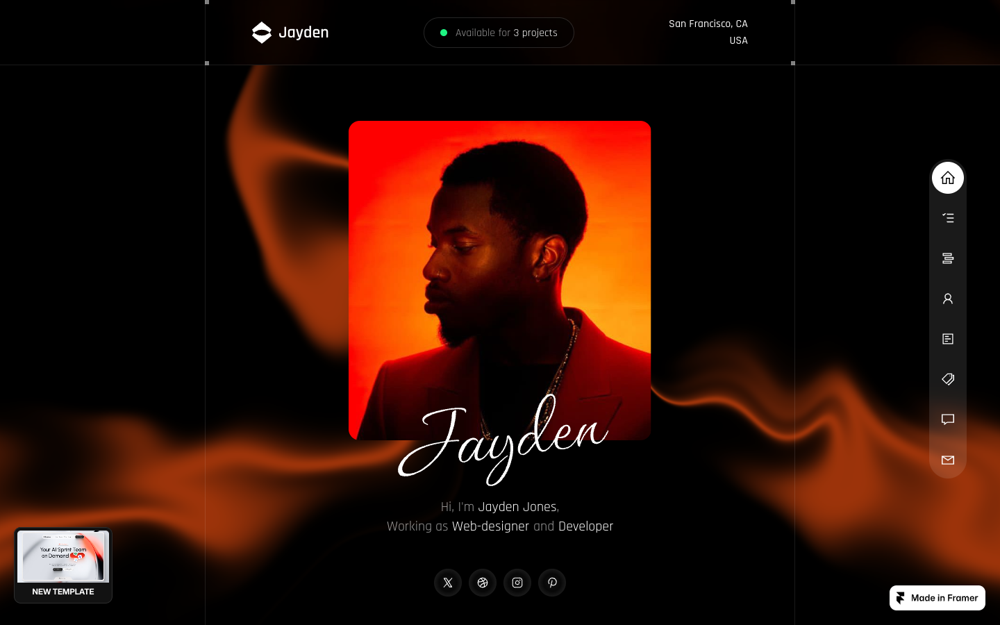

# 02: Jayden Portfolio

Source: https://jayden-portfolio.framer.website/

## Observed system

- A nearly black page uses narrow content islands and unusually large vertical gaps.
- Surfaces are dark graphite with soft borders and radii commonly around `16-40px`.
- Project cards vary in size and aspect ratio; the page avoids a generic three-column feature grid.
- Orange is limited to small focal events, image light, icons, and the final ambient glow.
- The work process uses a sticky stack of compact modules.

## Why it matters

Jayden is the best reference for restraint. It gives the background room and makes each module feel deliberate instead of filling every viewport.

## Grillme translation

- Use isolated dark modules for secondary proof, metrics, and commit evidence.
- Preserve generous gaps between major narrative beats.
- Let bordeaux appear inside content and at stage edges, not as constant page fill.
- Avoid equal card dimensions; size should reflect importance.

## Behavior and extractable components

- Content islands arrive after long atmospheric pauses; scrolling never feels like moving through a card catalog.
- Dark sections dissolve through broad, uneven shadows instead of ending on a hard horizontal edge.
- Extract the asymmetric black veil for Prism-to-content transitions and the narrow, isolated proof module for commit receipts.
