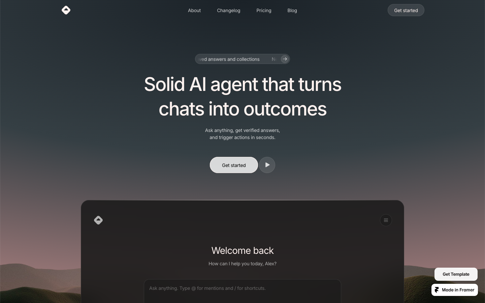
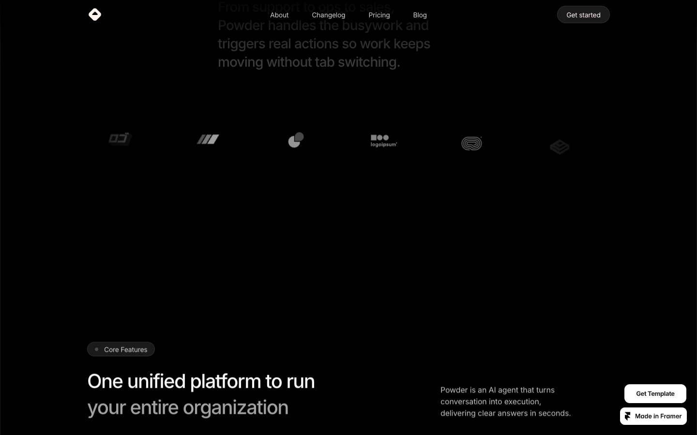

# 03: Powder

Source: https://powder.framer.website/

## Observed system

- A large product UI floats inside a scenic hero rather than sitting in a separate feature section.
- Rounded frames frequently use `16-24px`, while ambient masks and visual fields use very large elliptical radii.
- Long black intervals separate dense product moments and prevent the page from feeling like a dashboard catalog.
- Product explanations pair short editorial copy with large visual demonstrations.
- The lower CTA returns to the hero atmosphere, creating visual closure.

## Why it matters

Powder demonstrates how the product itself can be the landing page's main image. Grillme should treat the roast stage the same way.

## Grillme translation

- Make the streaming roast interface the hero artifact.
- Repeat the background atmosphere at the final reveal to close the narrative loop.
- Keep secondary explanation beside or beneath product visuals, never above them in hierarchy.
- Use dark intervals as soft masks, not abrupt opaque section rectangles.

## Behavior and extractable components

- The primary interface is revealed at presentation scale before the page explains individual features.
- Scenic atmosphere returns around later product chapters, giving the long page a visual loop.
- Extract a wide product viewport for the final roast and a separate product-demo chapter for streamed analysis; never compress both into one dashboard.
