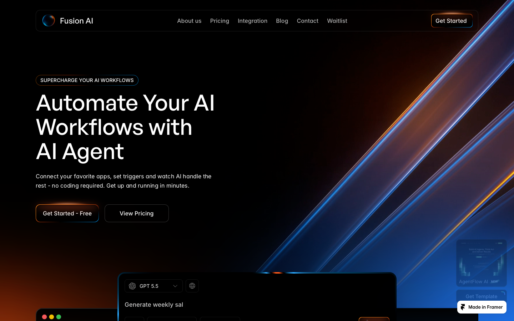

# 04: Fusion AI

Source: https://fusionai.framer.website/

## Observed system

- The hero combines a dark field, diagonal light bands, orange and blue edge light, and layered application windows.
- Most modules use practical radii between `8-20px`; the page feels soft through lighting and spacing more than oversized rounding.
- Product workflows are shown as large screenshots with smaller textual anchors.
- Repeated black space keeps the high-energy visuals from blending together.

## Why it matters

Fusion shows how directional light can create depth around otherwise restrained interface frames.

## Grillme translation

- Reuse directional bordeaux light only around the roast stage and reveal.
- Layer progress/status modules over the main stage to suggest agentic work without chat bubbles.
- Keep supporting surfaces quieter than the Prism background.

## Do not copy

The dual orange/blue lighting adds a second accent system. Grillme should stay one-accent and bordeaux-led.

## Behavior and extractable components

- Interface layers overlap at different depths and move as one product composition rather than independent floating cards.
- Extract a restrained live-status layer for the agent stream, but keep it inside one analysis shell.
- Directional light may frame the active state; it must not introduce a second accent hue.
