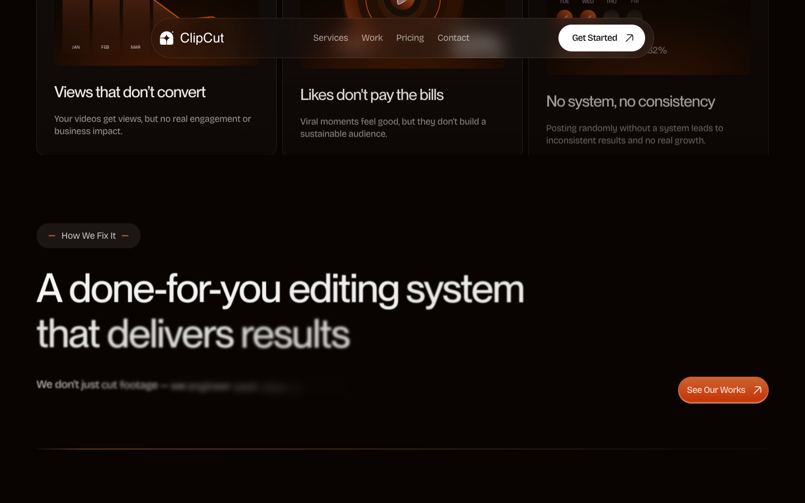

# 05: ClipCut

Source: https://clipcut.framer.ai/

## Observed system

- The base is a warm near-black around `rgb(9, 4, 1)`, not pure black.
- Orange atmosphere enters as large blurred fields and thin traces, while content surfaces remain dark.
- The page uses `16-20px` module radii and larger `48-100px` framing radii.
- Cards are dense but grouped into a few large narrative chapters.
- The system repeatedly transitions from glow to near-black and back.

## Why it matters

ClipCut is the closest reference for the requested background treatment: colored atmosphere can remain present without sitting directly behind every line of text.

## Grillme translation

- Tint the near-black base subtly toward bordeaux.
- Use deep, broad shadows to let Prism fade behind readable sections.
- Return the moving red field at deliberate chapter boundaries.
- Keep colored glow below the content, not as a card fill.

## Behavior and extractable components

- Glow intensity changes between chapters while the readable surface remains almost black.
- Broad black shadows make the animated field appear to recede naturally rather than switch off.
- Extract the glow-to-black-to-glow transition model for the area between target, analysis, and result.
