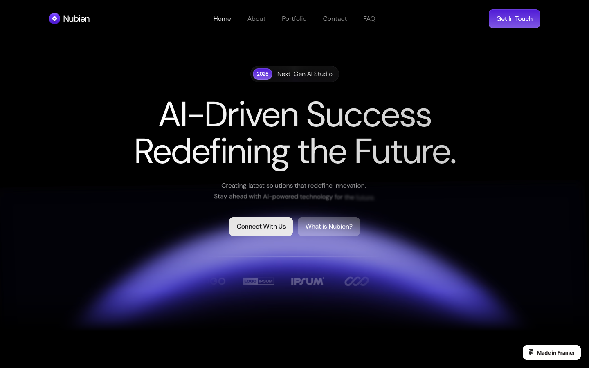

# 06: Nubien

Source: https://nubien.framer.website/

## Observed system

- The page is a dark AI-agency system with repeated purple spotlights, centered headings, and dense card groups.
- Modules use a broad radius range around `10-40px`.
- Product frames and integrations are consistently polished, but most sections repeat the same visual hierarchy.

## Useful lesson

Large product collages, integration orbits, and contained dark panels can explain complex capability quickly.

## Grillme translation

- Borrow the idea of a single evidence collage for commits, files, and model activity.
- Keep only one such dense section.

## Avoid

- purple AI lighting
- centered heading plus card grid repeated through the whole page
- equal emphasis across every capability

This source is primarily a boundary reference: it shows how quickly a technically polished dark site can become generic AI-SaaS.

## Behavior and extractable components

- The dense collage explains capability quickly, but repeated centered grids flatten the hierarchy later in the page.
- Extract at most one evidence collage showing repositories, files, and commit excerpts around the analysis state.
- Do not extract orbit graphics, purple spotlights, or repeated capability grids.
