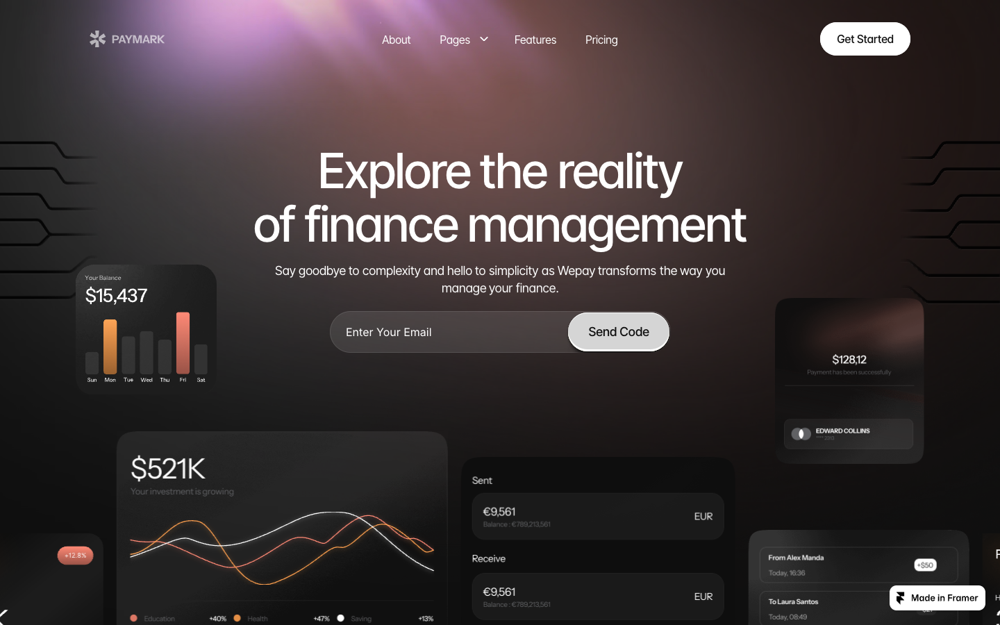

# 07: Paymark

Source: https://paymark.framer.website/

## Observed system

- A dark charcoal base uses blurred mauve/rose lighting rather than a saturated accent fill.
- The hero surrounds the central heading with floating product fragments.
- Three large feature shells repeat a text-left, image-right composition with radii around `20-32px`.
- Pricing and CTA areas use contained blush light to create focus.
- Sticky feature panels turn a product flow into a scroll narrative.

## Why it matters

Paymark is a strong color-behavior reference. Its accent is visible as atmosphere but the page remains calm and readable.

## Grillme translation

- Use bordeaux as reflected light around the stage.
- Float commit, repository, and status fragments around the central roast input.
- Apply stronger rose light only at the intensity control and final result.
- Use sticky product chapters sparingly.

## Behavior and extractable components

- Small product fragments establish context around one dominant center without becoming a dashboard.
- Feature stages keep a stable shell while copy and visuals change with scroll.
- Extract one persistent analysis stage and a small number of commit fragments; the username field must remain visually dominant.
