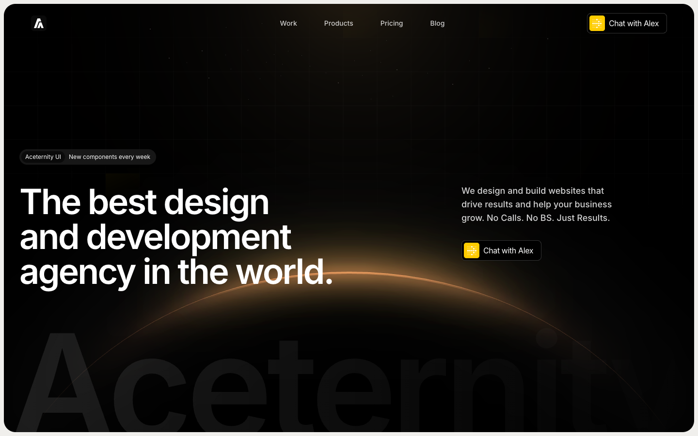

# 09: Aceternity productized agency

Source: https://ui.aceternity.com/template-preview/productized-agency-template

Preview source: https://productized-agency-template-acetern.vercel.app/

## Observed system

- The page uses a large dark rounded hero followed by a warm off-white content field.
- The hero product promise and one action occupy the majority of the first viewport.
- Bento modules combine screenshots, short copy, and uneven spans inside `16-24px` shells.
- Large typographic labels such as `Projects` create chapter transitions without extra containers.
- Yellow acts as a single compact signal.

## Why it matters

This reference shows how a marketing page can be information-dense while maintaining strong hierarchy and quiet surfaces.

## Grillme translation

- Treat the main roast stage as the dark hero shell.
- Use one accent action and one large promise.
- Apply oversized chapter labels behind or between evidence sections.
- Borrow uneven bento spans for commit evidence, not the light-mode palette.

## Behavior and extractable components

- One promise and one action occupy the opening shell; supporting proof waits until the product has been understood.
- Chapter labels work as spatial separators without adding more card chrome.
- Extract the single-action hero hierarchy and uneven evidence grid for `/test-2`.
