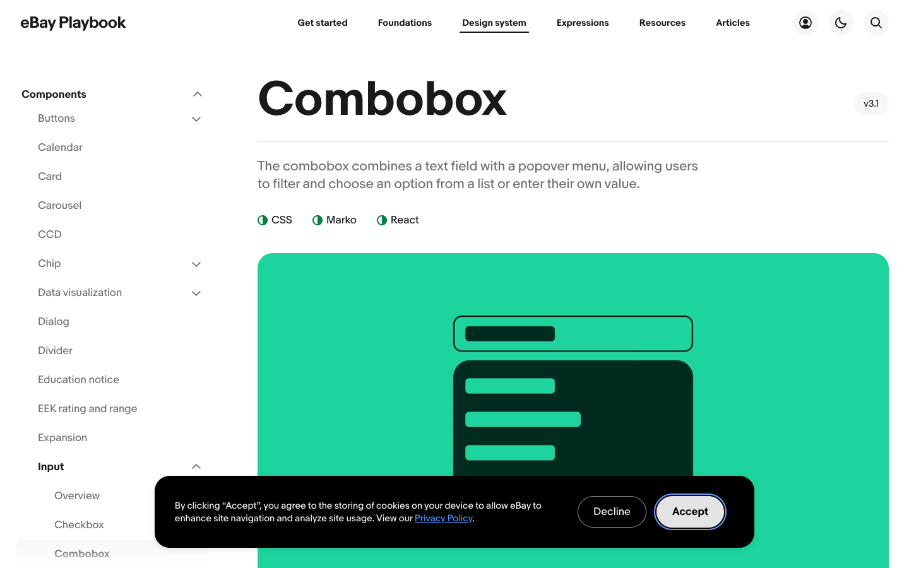

# 12: eBay combobox

Source: https://playbook.ebay.com/design-system/components/combobox/?tab=design

## Observed system

- The component is structurally plain but consistently softened with `8px` fields, `16-24px` examples, and pill controls where the interaction benefits.
- The documentation makes state, helper text, error behavior, width constraints, and small/medium/large layouts explicit.
- Rounding supports touch comfort and recognizability; it is not used as decoration.

## Why it matters

The reference is not a visual direction for the landing page. It is a reminder that a rounded design language must remain systematic at control level.

## Grillme translation

- Inputs and combobox-like target controls use a stable `12-16px` control radius.
- Status and intensity selectors may be pills because they represent compact state.
- Error, loading, helper, and selected states must be designed alongside the default state.
- Large section radii must not leak into text fields and menus.

## Behavior and extractable components

- The username control needs explicit default, focus, loading, invalid-user, disabled, and populated states before production migration.
- Helper and error text reserve space instead of shifting the surrounding stage.
- Extract the state contract and control sizing, not the visual palette.
