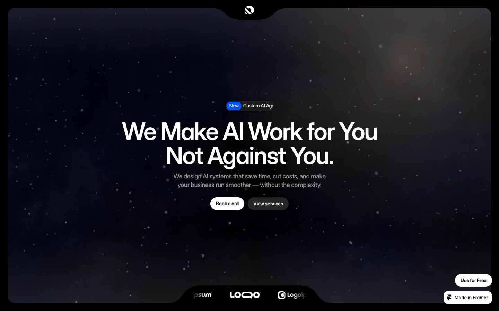

# 13: Knotch

Source: https://knotch.framer.ai/

## Observed system

- A black page uses rounded dark panels, star-field atmosphere, and one cool blue accent.
- The opening visual is a large rounded window rather than a full-bleed hero.
- Most information is organized into dense but readable bento groups with `12-20px` radii.
- Later sections become increasingly card-heavy and lose some of the opening hierarchy.

## Grillme translation

- Use a framed hero window when the Prism background needs stronger containment.
- Borrow the restrained black-on-black panel hierarchy.
- Keep the initial strong stage hierarchy through the whole page.

## Avoid

- repeating equal dark cards for every capability
- adding a second blue signal color
- star-field decoration that competes with the grill/heat metaphor

## Behavior and extractable components

- The opening window has a stronger edge and deeper background than its internal modules, making hierarchy readable in black-on-black.
- Extract that nested contrast model for the final roast viewport.
- Stop after one strong stage; later equal-weight card repetition is the failure mode to avoid.
