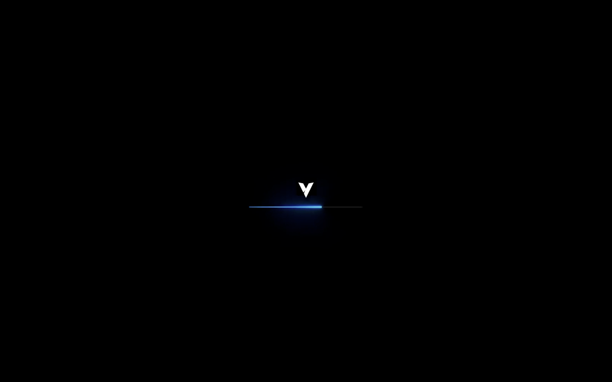
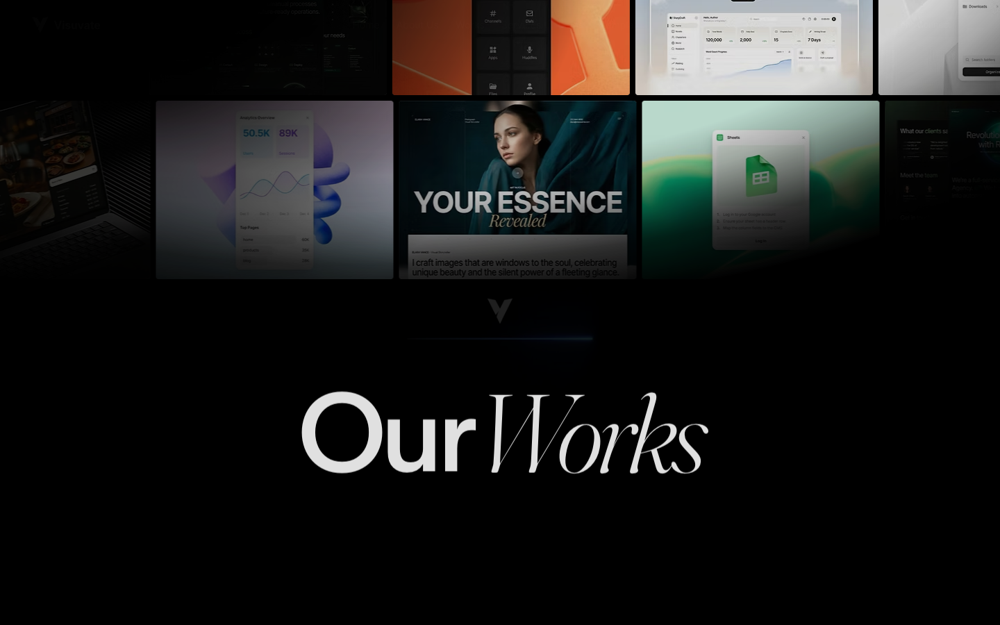

# 14: Visuvate

Source: https://www.visuvate.com/

## Observed system

- The site uses very large black negative-space intervals around highly polished product and project imagery.
- Product UI is layered in the hero with colored light behind it.
- Cards use practical radii around `12-24px`, while masks and image treatments use much larger curves.
- The typography stays small and controlled next to visually dense work samples.
- Later bento modules are asymmetric and combine interface crops, labels, and ambient texture.

## Why it matters

Visuvate demonstrates that negative space can carry perceived quality. Not every scroll position needs a full section of information.

## Grillme translation

- Give the roast stage isolated moments with no competing content nearby.
- Use interface crops and commit fragments as visual material, not stock illustration.
- Keep explanatory copy short where the product artifact already communicates the point.
- Let the bordeaux background provide atmosphere across otherwise empty space.

## Behavior and extractable components

- Product crops appear after deliberate empty intervals, so each one reads as an event.
- Text remains compact next to visually dense artifacts rather than explaining every detail twice.
- Extract the negative-space rhythm around the final result and use commit excerpts as the visual material.
