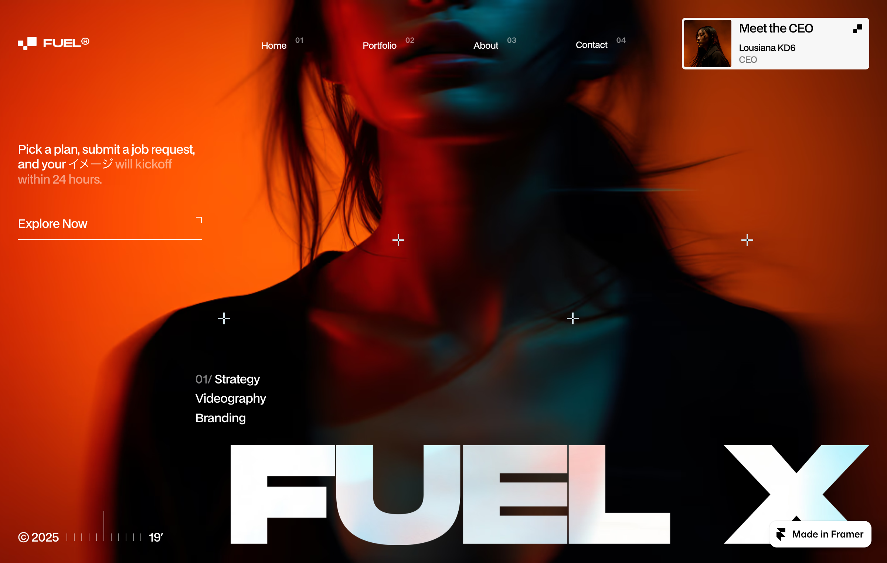
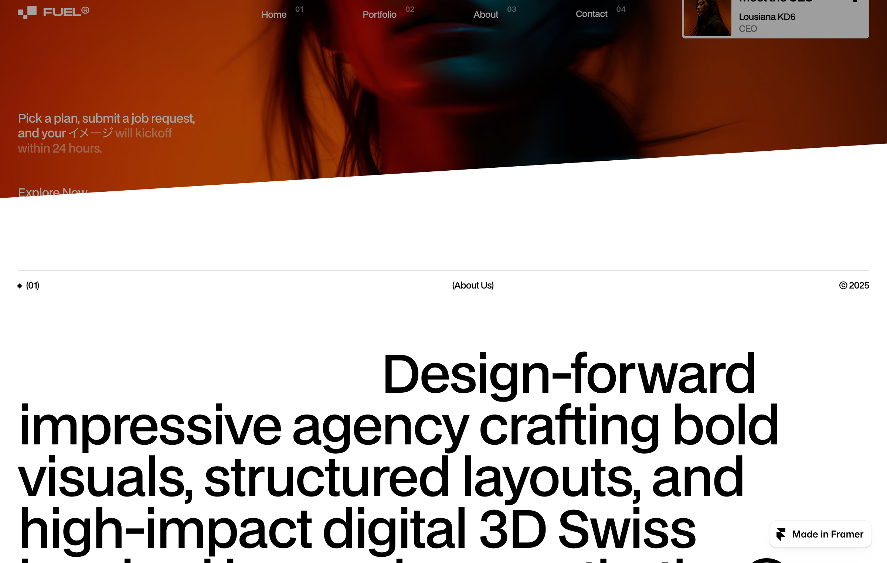
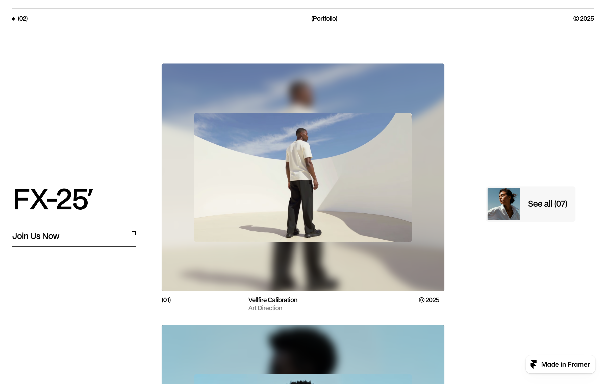
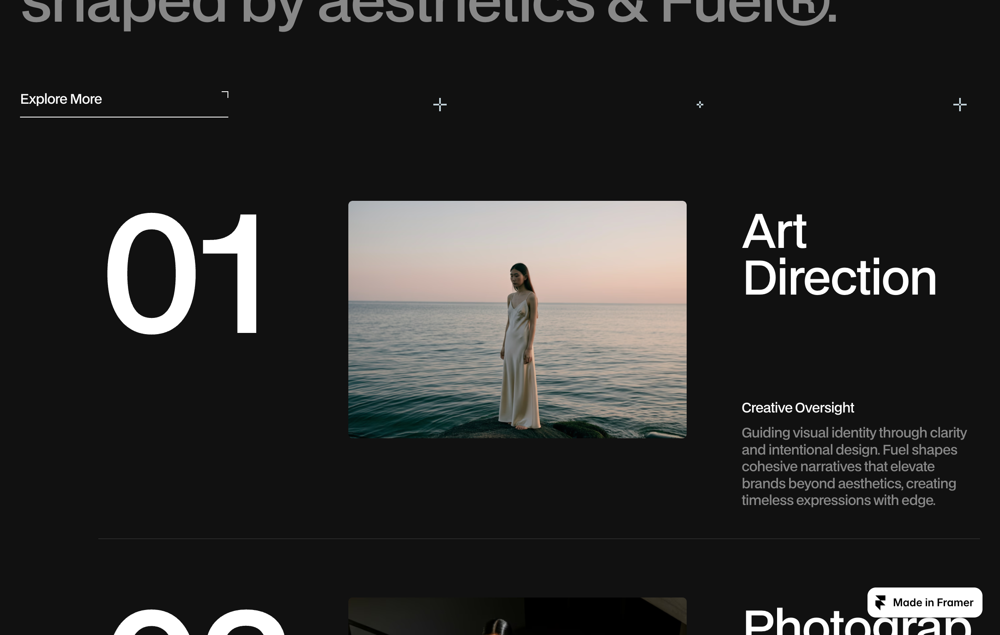

# 15: Fuel

Source: https://fuel.framer.website/

Captured: 2026-07-25

## Observed system

Fuel combines three separate layout systems. The visual result feels continuous because each system hands the viewport to the next one instead of ending in a hard section cut.

### 1. Sticky hero and moving chapter cover

- The hero is approximately one viewport high and uses `position: sticky` with clipped overflow.
- Its visual layer is oversized beyond the viewport. The inspected canvas measured about `1440 x 914` inside a `1200 x 762` viewport, providing overscan for movement without revealing an edge.
- The hero receives a scroll-linked vertical translation of roughly ten percent of the root scroll distance. It therefore feels anchored, but not completely frozen.
- The following white chapter has a dedicated background layer rather than skewing its content.
- That cover starts flat and animates toward roughly `skewY(-7deg)` plus a `-220px` translation. At the middle of the handoff it measures about `skewY(-3.2deg)`.
- The straight content layer moves above the skewed cover independently. Typography and grid lines therefore remain undistorted.

This is the source of the changing-shape impression: the page does not morph one component. A new chapter masks the pinned scene with an angled surface.

### 2. Persistent rails and a sticky focal stack

- The portfolio uses three columns: persistent context on the left, the active project in the center, and a persistent archive action on the right.
- The left rail, center projects, and right rail are sticky. The active center card settles around `90px` from the viewport top.
- Center cards replace one another during vertical scrolling instead of moving through a horizontal carousel.
- The active card receives a small scroll-linked scale and translation. An observed state was approximately `scale(0.958)` with a `-21px` vertical translation.
- Each project visual combines a blurred, full-bleed duplicate with a sharp inset image. The blur supplies atmosphere while the inset preserves legibility.
- Radii are restrained. The image itself uses a small radius instead of turning the complete composition into a large pill or glass card.

The important pattern is persistent context plus a moving focal layer. The user always knows where they are while the main artifact changes.

### 3. Editorial chapters after the motion

- Later service sections abandon the stacked-card treatment.
- Large sequence numbers, short labels, oversized titles, images, and thin rules define the hierarchy.
- The archive becomes a table-like layout with year, project title, and image samples aligned on a strict grid.
- Alternating black and white chapters provide stronger separation than decorative containers.
- Most content is placed directly on the page. Cards are used only when they represent a real object, not as default wrappers.

## Why it works

- Motion communicates chapter ownership instead of decorating every element.
- One focal object moves while surrounding context stays stable.
- The angled cover hides the technical boundary between an atmospheric hero and a practical content surface.
- Large type, thin rules, and grid alignment carry hierarchy without requiring nested Bento cards.
- The system changes visual density between chapters, which prevents one long page from feeling mechanically repeated.

## Grillme translation

Fuel's orange palette, portfolio imagery, and agency content should not be copied. The transferable structure can work with Grillme's black and Signal Red direction.

### Homepage transition

- Keep the shader inside the opening scene rather than behind the complete page.
- Pin the opening scene for a bounded scroll interval.
- Let a warm off-white editorial chapter rise over it with a shallow asymmetric angle.
- Implement the angle as a separate cover layer so all result content remains straight.
- Continue through the investigation and product explanation on the light surface before returning to true black. The shader should no longer compete with evidence and feedback.

### Roast investigation

- Treat the Chain of Thought as a sticky context rail, not an endlessly growing block above the answer.
- Keep compact identity, elapsed time, and current investigation state in the persistent rail.
- Replace the central focal content as evidence arrives: repositories, selected commits, prepared context, and final verdict.
- Keep a small secondary rail for grade, stink score, commit count, and files inspected.
- On narrow screens, collapse all three areas into normal document flow rather than attempting a sticky stack.

### Result presentation

- Use the verdict as the first focal artifact, but reduce its scale enough to keep grade and evidence visible in the same viewport.
- Present selected commits as substantial evidence rows, not tiny metadata chips.
- Put roast points and useful feedback into an editorial grid with rules and alignment instead of another nested card collection.
- Reserve containers for objects with an actual boundary, such as one commit diff, one score summary, or one expandable reasoning step.
- Prefer low-radius or sharp chapter surfaces if the structural rebrand moves toward a more angular visual language.

## Suggested Grillme sequence

1. **Target scene:** shader, navigation, positioning statement, and GitHub input.
2. **Investigation handoff:** an angled black cover rises over the shader while the Chain of Thought becomes the persistent context.
3. **Evidence stack:** repositories and commits replace one another in the center while summary metrics remain visible.
4. **Verdict chapter:** the final title and grade become the focal object without hiding the supporting evidence.
5. **Editorial damage report:** roast points and actionable feedback continue on a flat grid with thin separators.

## Motion and performance constraints

- Animate compositor-friendly `transform` and `opacity` properties.
- Use one atmospheric background layer. Do not reproduce Fuel's canvas, multiple blurred media layers, and Grillme's shader simultaneously.
- Bound blur to the active focal object and avoid full-viewport blur filters.
- Apply `will-change` only while an element participates in a scroll transition.
- Stop shader rendering after the atmospheric scene is fully covered or outside the viewport.
- Provide a `prefers-reduced-motion` version with the same chapter order and a static angled handoff.
- Avoid scroll listeners that update Vue reactive state every frame. Prefer native sticky positioning, CSS scroll-driven behavior where support allows it, or one throttled animation controller.

## Core principle

The reusable idea is not "add parallax." It is:

> Keep context stable, move one focal layer, and let each chapter cover the previous visual world.

That principle directly addresses Grillme's current problem of placing every state and result inside one large, rounded, continuously growing card.

## Prototype implementation

The complete structural study is implemented on the homepage at `/`.

- `RebrandChapterShell` owns the scroll-linked diagonal cover edges and light/dark chapter surfaces.
- Hero and target content scroll through one sticky Prism scene. The shader remains limited to that opening world.
- The first paper chapter is pulled back by one viewport so the shader stays pinned until the cover has fully passed it.
- The hero drifts at ten percent of the root scroll distance while the paper cover animates from flat to approximately seven degrees.
- A typed Fuel view model merges live stream data, local preview data, and stable evidence fallbacks without changing the roast API.
- The evidence portfolio translates Fuel's persistent side rails and sticky center projects into grade/intensity context, commits, files, reasoning, and verdict panels.
- The dark service chapter becomes the agent pipeline. Pricing becomes roast intensity selection.
- Testimonial, archive, contact, stats, article, and FAQ chapters are retained as Grillme-specific verdict, receipt, CTA, metric, evidence-note, and product-explanation sections.
- The closing navigation is a dedicated black chapter rather than a small footer row inside the final paper chapter. Its oversized Grillme wordmark, contact prompt, and numbered links follow Fuel's terminal composition without copying its identity.
- Native CSS scroll timelines and sticky positioning drive the motion. No scroll listener or per-frame Vue state is used.

### Chapter handoff geometry

The prototype now follows Fuel's generated Framer structure and measured motion rather than approximating it with viewport-relative sizing:

- Every incoming chapter owns an `834px` absolute overlap region at its top.
- The overlap plate moves from `translateY(0) skewY(0deg)` to `translateY(-220px) skewY(-7deg)`.
- A named view timeline maps that transform from `entry 0%` to `entry 100%`, so the motion starts when the chapter reaches the bottom of the viewport and finishes when its top reaches the top of the viewport.
- The final footer is the measured exception: its overlap region is `530px` high and uses its own view timeline. This produces Fuel's quicker final paper-to-black handoff instead of stretching that transition across a full viewport.
- All chapter edges rise in the same direction. Alternating diagonal directions are not part of the Fuel reference.
- Chapter hosts remain `overflow-visible`; clipping belongs to visuals inside a chapter, never to the overlap plate.
- The sticky hero viewport stays fixed. Only an oversized shader layer drifts inside it, preventing the parallax motion from exposing a plain black gap before the first paper chapter arrives.
- Reduced-motion mode preserves the final static diagonal while disabling scroll-linked interpolation.
- Fuel uses Lenis, but Grillme intentionally keeps native scrolling. Adding another continuous animation loop beside the WebGL shader would increase CPU cost without being necessary for the chapter geometry.

### Deliberately not copied

- Fuel photography, brand marks, orange palette, agency claims, prices, and portfolio names.
- Full-viewport blur layers beyond the opening shader.
- Decorative cards that do not represent a commit, file, verdict, intensity choice, or other bounded product object.
- Sticky behavior on narrow screens, where the same chapters return to normal document flow.

This implementation intentionally keeps every Fuel chapter for evaluation. Sections can be removed after the complete rhythm has been reviewed without rebuilding the transition or data architecture.
