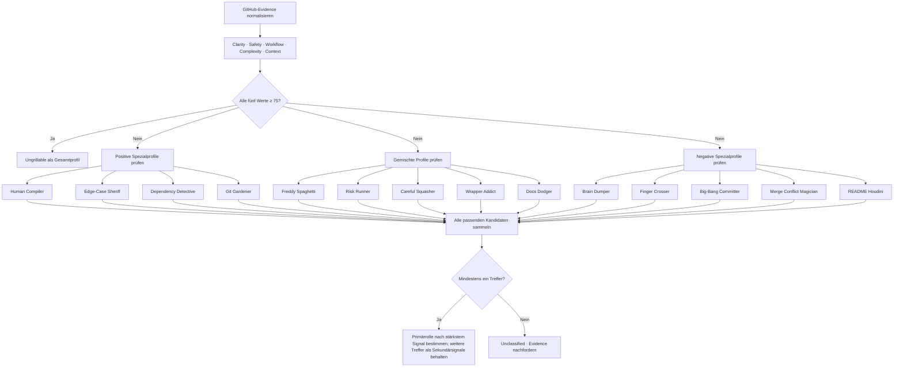

# Dashboard Profiles

Arbeitsgrundlage für die Profilrollen im GrillMe-Dashboard. Die Rollen werden
aus fünf normalisierten Achsen und konkreter GitHub-Evidence abgeleitet. Die
Dokumentation trennt dabei bewusst zwischen Score, Rolle und Note:

- **Score** beschreibt eine einzelne Eigenschaft von `0–100`.
- **Rolle** beschreibt ein wiederkehrendes Arbeitsmuster.
- **Note** beschreibt die Gesamtbewertung des Repositories.

## Profilachsen

| Achse | Was gemessen wird |
| --- | --- |
| **Clarity** | Lesbarkeit, Benennung, lokale Struktur und nachvollziehbare Patterns |
| **Safety** | Error Handling, Validierung, Tests sowie Daten- und Vertrauensgrenzen |
| **Workflow** | Commit-Granularität, Messages, Reihenfolge und nachvollziehbare Arbeitspakete |
| **Complexity** | Kontrolle von Verschachtelung, Abhängigkeiten, Zyklen, Duplikation und Abstraktion |
| **Context** | Dokumentation, Projektorientierung und Erklärbarkeit der nächsten Änderung |

Ein hoher Wert ist immer gut. Bei **Complexity** bedeutet ein hoher Wert also
gute Komplexitätskontrolle, nicht mehr Komplexität.

Für **Safety** gilt die serverseitige Regel aus
[dashboard-profile-scoring.md](./dashboard-profile-scoring.md): fehlende Tests,
CI, PRs oder Patch-Ausschnitte sind keine Risiken. Ohne verwertbare Patch-
Evidence bleibt Safety bei `50` und das Profil wird bei der späteren
Rollenauflösung als `Unclassified` behandelt, statt künstlich gerankt zu
werden. Für eine Rollenauflösung braucht der Server mindestens drei Commits
und einen verwertbaren Patch.

Für **Workflow** gilt ebenfalls die serverseitige Regel aus
[dashboard-profile-scoring.md](./dashboard-profile-scoring.md): Messages,
reviewbare Dateibreite, relative Ausreißer und sichtbare PR-Abdeckung werden
gewichtet. Merge-Commits werden aus der persönlichen Bewertung herausgenommen
und bleiben Kontext für das Dashboard. Commit-Frequenz ist ebenfalls nur
Kontext und erhöht den Workflow-Score nicht automatisch. Die Zahl wird
deterministisch berechnet; AI darf später nur die Begründung liefern.

Übergreifend gilt die [Evidenz-Regel für neutrale Scores](../decisions/active/neutral-score-for-insufficient-evidence.md):
Wenn eine Kategorie aus dem begrenzten Sample nicht belastbar beurteilt werden
kann, bleibt sie bei `50` als neutralem **Nicht-genug-Evidenz**-Wert. Das ist
keine Durchschnittsnote. Fehlende Signale werden nicht automatisch bestraft,
und ein Profil ohne ausreichende Evidenz bleibt `Unclassified`.

## Rollenmatrix

`—` bedeutet: Für die Rolle gibt es auf dieser Achse keinen eigenen
Spezialschwellwert. Unterstützende Mindestwerte verhindern trotzdem, dass eine
Rolle mit einem kritischen Gesamtprofil falsch positiv wird.

### Positive Rollen

| Rolle | Clarity | Safety | Workflow | Complexity | Context |
| --- | ---: | ---: | ---: | ---: | ---: |
| [Human Compiler](./profiles/human-compiler.md) | `≥85` | `≥60` | `≥60` | `≥65` | `≥65` |
| [Edge-Case Sheriff](./profiles/edge-case-sheriff.md) | `≥65` | `≥85` | `≥60` | `≥60` | `≥60` |
| [Dependency Detective](./profiles/dependency-detective.md) | `≥70` | `≥65` | `≥60` | `≥85` | `≥60` |
| [Git Gardener](./profiles/git-gardener.md) | `≥70` | `≥60` | `≥85` | `≥60` | `≥60` |
| [Ungrillable](./profiles/ungrillable.md) | `≥75` | `≥75` | `≥75` | `≥75` | `≥75` |

### Gemischte Rollen

| Rolle | Clarity | Safety | Workflow | Complexity | Context |
| --- | ---: | ---: | ---: | ---: | ---: |
| [Freddy Spaghetti](./profiles/freddy-spaghetti.md) | `40–60` | `≥65` | `≥65` | `≥60` | `≥65` |
| [Risk Runner](./profiles/risk-runner.md) | `≥65` | `40–60` | `≥65` | `≥65` | `≥65` |
| [Careful Squasher](./profiles/careful-squasher.md) | `≥70` | `≥70` | `40–60` | `≥60` | `≥70` |
| [Wrapper Addict](./profiles/wrapper-addict.md) | `≥65` | `≥65` | `≥65` | `40–60` | `≥65` |
| [Docs Dodger](./profiles/docs-dodger.md) | `≥65` | `≥65` | `≥65` | `≥65` | `≤50` |

Die gemischten Rollen sind keine lineare Qualitätsstufe. Sie beschreiben ein
insgesamt brauchbares Profil mit genau einer auffälligen Schwäche.

### Negative Rollen

| Rolle | Clarity | Safety | Workflow | Complexity | Context |
| --- | ---: | ---: | ---: | ---: | ---: |
| [Brain Dumper](./profiles/brain-dumper.md) | `≤35` | `≥55` | `≥55` | `≥55` | `≥55` |
| [Finger Crosser](./profiles/finger-crosser.md) | `≥55` | `≤35` | `≥55` | `≥55` | `≥55` |
| [Big-Bang Committer](./profiles/big-bang-committer.md) | `≥55` | `≥55` | `≤35` | `≥55` | `≥55` |
| [Merge Conflict Magician](./profiles/merge-conflict-magician.md) | `≥55` | `≥55` | `≥55` | `≤35` | `≥55` |
| [README Houdini](./profiles/readme-houdini.md) | `≥55` | `≥55` | `≥55` | `≥55` | `≤35` |

Die negative Gruppe beschreibt jeweils eine dominante Schwäche. Sie ist nicht
mit dem übergreifenden [Vibe Coder](./profiles/vibe-code.md)-Profil identisch:
`Vibe Coder` wird vergeben, wenn mindestens drei Achsen gleichzeitig sehr
schwach sind.

## Auswahlmodell

Die Matrix ist kein `else-if`-Block, bei dem jede spätere Rolle von einer
früheren verdrängt wird. Stattdessen werden alle passenden Rollen als
Kandidaten gesammelt:

`Ungrillable` wird zuerst als Gesamturteil erkannt. Bei allen anderen Profilen
werden Treffer parallel gesammelt. Das verhindert, dass etwa ein starkes
Clarity-Signal automatisch ein ebenfalls zutreffendes Workflow- oder
Safety-Signal unsichtbar macht.

## Abdeckungsregeln

Vor der Implementierung der Rollenberechnung werden künstliche Testprofile
gegen die Matrix geprüft:

1. Jede Rolle muss mindestens ein erreichbares Testprofil haben.
2. Jede gemischte Rolle muss genau eine bewusste Schwäche zeigen.
3. Kein gemischtes Profil darf `Ungrillable` erreichen.
4. Ein Profil ohne ausreichende Evidence wird `Unclassified`, nicht zufällig
   einer Rolle zugeordnet.
5. Überschneidungen werden als Kandidaten dokumentiert und nicht still
   verworfen.
6. Die Verteilung der Rollen wird beobachtet, aber nicht künstlich erzwungen.

Die Score-Bänder sind absichtlich nicht so breit, dass jeder beliebige Wert
eine Rolle erzwingt:

- `0–35`: klare negative Ausprägung
- `36–60`: gemischte Ausprägung, wenn die übrigen Achsen stabil sind
- `61–84`: neutrale bis gute Zone ohne automatische Spezialrolle
- `85–100`: klare positive Ausprägung

Die neutrale Zone ist kein fehlender Matrixeintrag. Sie verhindert, dass ein
leicht unterdurchschnittlicher Wert automatisch als Roast interpretiert wird.

### Gesamtbewertung

Die Dashboard-Note wird nicht pro Rolle manuell vergeben. Sie ist der
arithmetische Mittelwert der fünf Achsen und wird anschließend in diese
reproduzierbaren Notenbänder übersetzt:

| Durchschnitt | Note |
| ---: | :--- |
| `90–100` | A |
| `85–89` | A- |
| `80–84` | B+ |
| `75–79` | B |
| `70–74` | B- |
| `65–69` | C+ |
| `60–64` | C |
| `55–59` | C- |
| `50–54` | D+ |
| `45–49` | D |
| `40–44` | D- |
| `30–39` | E |
| `20–29` | E- |
| `0–19` | F |

Eine Spezialrolle beschreibt weiterhin die auffällige Achse. Die Note bleibt
aber das Gesamturteil: Ein `Edge-Case Sheriff` kann deshalb ein B sein, wenn
Safety stark ist, die übrigen Dimensionen aber nur solide ausfallen. Nur ein
Profil mit mehreren gleichzeitig sehr niedrigen Achsen erhält eine wirklich
schlechte Gesamtnote wie E oder F.

Die Mock-Profile verwenden exakt diese Funktion. Später muss die AI dieselbe
Regel mit normalisierten GitHub-Evidence-Werten beliefern; sie darf weder die
Note unabhängig vom Score setzen noch eine Rolle als Ersatz für die
Gesamtbewertung verwenden.

Wenn eine Rolle in echten Daten unverhältnismäßig häufig vorkommt, werden zuerst
Evidence und Schwellwerte geprüft. Eine künstliche Gleichverteilung würde die
Analyse verfälschen.

## Rollenblätter

Jede Rolle hat ein eigenes Blatt mit Scoring, erwarteter Evidence,
Roast-Richtung und konstruktiver Empfehlung:

- [Human Compiler](./profiles/human-compiler.md)
- [Edge-Case Sheriff](./profiles/edge-case-sheriff.md)
- [Dependency Detective](./profiles/dependency-detective.md)
- [Git Gardener](./profiles/git-gardener.md)
- [Ungrillable](./profiles/ungrillable.md)
- [Freddy Spaghetti](./profiles/freddy-spaghetti.md)
- [Risk Runner](./profiles/risk-runner.md)
- [Careful Squasher](./profiles/careful-squasher.md)
- [Wrapper Addict](./profiles/wrapper-addict.md)
- [Docs Dodger](./profiles/docs-dodger.md)
- [Brain Dumper](./profiles/brain-dumper.md)
- [Finger Crosser](./profiles/finger-crosser.md)
- [Big-Bang Committer](./profiles/big-bang-committer.md)
- [Merge Conflict Magician](./profiles/merge-conflict-magician.md)
- [README Houdini](./profiles/readme-houdini.md)
- [Vibe Coder](./profiles/vibe-code.md)

Die Negativgruppe ist absichtlich noch nicht enthalten. Sie wird nach den
positiven und gemischten Profilen anhand derselben Matrixregeln ergänzt.
