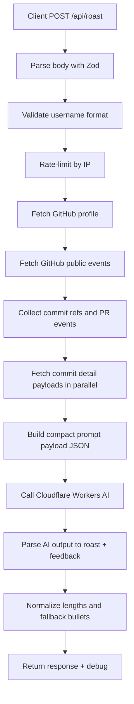
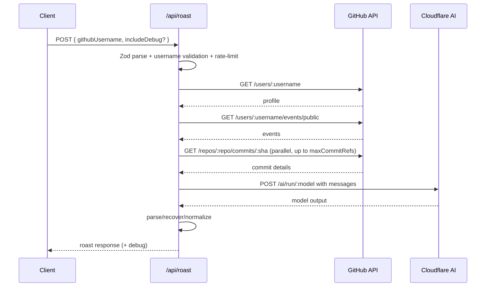

# Roast API (v1)

This document describes the current `POST /api/roast` flow end-to-end, including validation, GitHub enrichment, Cloudflare AI generation, debug payloads, and error behavior.

## Overview

The roast pipeline is server-first:

1. Client sends a GitHub username to `POST /api/roast`.
2. Server validates and normalizes input.
3. Server fetches public GitHub activity (events + commit details + PR events).
4. Server compacts this data into a JSON prompt payload.
5. Server calls Cloudflare Workers AI with strict output constraints.
6. Server returns normalized roast output (`roast`, `feedback`, `meta`) plus debug information.

No model call is executed from the browser. All tokens and secrets stay server-side.

## Main Files

- `/shared/roast/contracts.ts`
  - Central schemas (Zod), shared types, and defaults/limits.
- `/server/api/roast.post.ts`
  - Request orchestration, rate-limit, runtime option resolution, top-level logging.
- `/server/utils/roast.ts`
  - GitHub fetch/enrichment, AI call, parsing/recovery, final response normalization.
- `/app/composables/useRoast.ts`
  - Client request handling and console debug logs.

## Shared Contracts

Contracts are defined in `/shared/roast/contracts.ts`:

- `roastRequestBodySchema`
  - `{ githubUsername: string, includeDebug?: boolean|string|number }`
- `roastResponseSchema`
  - `{ username, roast, feedback, meta, debug? }`
- `resolveRoastRuntimeOptions(...)`
  - Parses and normalizes env/body values into runtime options.

### Defaults

`ROAST_DEFAULTS`:

- `rateLimitWindowMs`: `60000`
- `rateLimitMax`: `8`
- `githubTimeoutMs`: `12000`
- `aiTimeoutMs`: `25000`
- `aiMaxTokens`: `240`

### Limits

`ROAST_LIMITS`:

- `eventsPerPage`: `100`
- `maxCommitRefs`: `8`
- `maxPrs`: `6`
- `maxFilesPerCommit`: `4`
- `maxPatchChars`: `700`
- `maxResponsePreviewChars`: `1000`
- `maxRoastWords`: `220`
- `minFeedbackItems`: `3`
- `maxFeedbackItems`: `5`

## Request/Response

### Endpoint

- Method: `POST`
- URL: `/api/roast`
- Content-Type: `application/json`

### Request body

```json
{
  "githubUsername": "lafllamme",
  "includeDebug": true
}
```

### Success response (shape)

```json
{
  "username": "lafllamme",
  "roast": "string",
  "feedback": ["string", "string", "string"],
  "meta": {
    "commitCount": 8,
    "prCount": 0
  },
  "debug": {
    "username": "lafllamme",
    "timingsMs": {
      "githubFetch": 2066,
      "aiGenerate": 6107,
      "total": 8175
    },
    "requests": [],
    "github": {},
    "ai": {}
  }
}
```

### Error response

```json
{
  "error": {
    "code": "invalid_request",
    "message": "githubUsername is required"
  }
}
```

## Execution Flow



## Sequence Diagram



## GitHub Data Collected

The server does not clone repositories. It uses public API endpoints and sends a compact summary to the model.

Collected fields:

- User existence check
- Public events (`PushEvent`, `PullRequestEvent`)
- Up to `maxCommitRefs` commit details:
  - `repo`, `sha`, `message`
  - `additions`, `deletions`, `changedFiles`
  - up to `maxFilesPerCommit` file entries:
    - `filename`, `status`, `additions`, `deletions`, `patch?`

Patch handling:

- Patch snippets are truncated to `maxPatchChars`.
- Secret-like patterns are redacted before prompting.

## Prompt Input Payload

The user message sent to the model is JSON-stringified. Example:

```json
{
  "username": "lafllamme",
  "commits": [
    {
      "repo": "lafllamme/grill-me",
      "sha": "af0896e",
      "message": "",
      "additions": 299,
      "deletions": 199,
      "changedFiles": 14,
      "files": [
        {
          "filename": "server/utils/roast.ts",
          "status": "modified",
          "additions": 45,
          "deletions": 20,
          "patch": "@@ -1,4 +1,8 @@ ..."
        }
      ]
    }
  ],
  "prs": []
}
```

System prompt constraints:

- Output strict JSON: `{"roast":"...","feedback":["...","...","..."]}`
- No markdown/code fences
- Roast style/length constraints
- Technical critique only, no personal attacks
- Secret-safety requirement

## Debug Payload

`debug` includes:

- `timingsMs`
  - `githubFetch`, `aiGenerate`, `total`
- `requests[]`
  - every upstream call with stage, URL, duration, status
- `github`
  - event/commit extraction counters
- `ai`
  - model, token/timeouts, system prompt, sent user payload, response preview

Use this to trace exactly:

- what was fetched from GitHub,
- what was sent to the model,
- how long each step took.

## Error Behavior

Common error codes:

- `invalid_request` (400)
- `invalid_username` (400)
- `rate_limited` (429)
- `github_not_found` (404)
- `github_upstream_error` (502)
- `github_timeout` (503)
- `cloudflare_ai_not_configured` (503)
- `cloudflare_ai_error` (502/503)
- `cloudflare_ai_timeout` (503)

## Notes on Runtime Configuration

Current runtime keys (Nuxt):

- `NUXT_CF_ACCOUNT_ID`
- `NUXT_CF_API_TOKEN`
- `NUXT_CF_AI_MODEL`
- `NUXT_GITHUB_TOKEN`
- `NUXT_GITHUB_TIMEOUT_MS`
- `NUXT_CF_AI_TIMEOUT_MS`
- `NUXT_CF_AI_MAX_TOKENS`
- `NUXT_ROAST_DEBUG`

`resolveRoastRuntimeOptions(...)` applies defaults when values are missing or invalid.

