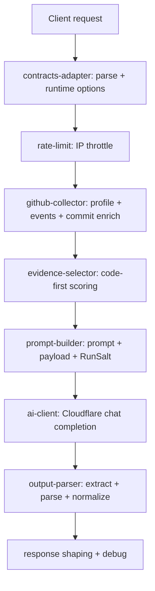

# Roast API (v2)

This document describes the current GitHub roast system (sync + stream), module responsibilities, contracts, and diagnostics.

## Endpoints

- `POST /api/roast`
  - returns one final JSON payload.
- `POST /api/roast/stream`
  - returns SSE (`text/event-stream`) for live typing UX.

## Shared contracts

Single source of truth:

- `/Users/flame/Developer/Projects/grill-me/shared/roast/contracts.ts`

Contains:

- request/response schemas
- stream event schemas
- debug schema
- runtime defaults/limits

## Request

```json
{
  "githubUsername": "lafllamme",
  "debugLevel": "minimal",
  "variationMode": "moderate"
}
```

Fields:

- `githubUsername` (required)
- `includeDebug` (legacy bool-like switch)
- `debugLevel` (`off | minimal | full`)
- `variationMode` (`stable | moderate | wild`)

## Final response contract

Used by:

- `POST /api/roast`
- stream `done` event payload

```json
{
  "username": "lafllamme",
  "roastLines": ["Line 1", "Line 2"],
  "roast": "Line 1 Line 2",
  "feedback": [
    "Action 1",
    "Action 2",
    "Action 3"
  ],
  "meta": {
    "commitCount": 12,
    "prCount": 0,
    "selectedCommitCount": 8
  },
  "debug": {
    "username": "lafllamme",
    "promptVersion": "grill-v2.0.0",
    "parserPath": "choices[0].message.content->json",
    "selectionSummary": {
      "candidateCommits": 12,
      "selectedCommits": 8,
      "selectedFiles": 35,
      "selectedPatchChars": 22406
    },
    "timingsMs": {
      "githubFetch": 1613,
      "aiGenerate": 16783,
      "total": 18397
    }
  }
}
```

Compatibility:

- `roastLines` is primary.
- `roast` is kept for legacy UI/clients.

## Error envelope

```json
{
  "error": {
    "code": "cloudflare_ai_timeout",
    "message": "Cloudflare AI request timed out"
  }
}
```

Common error codes:

- `invalid_username`
- `github_not_found`
- `github_timeout`
- `github_upstream_error`
- `rate_limited`
- `cloudflare_ai_not_configured`
- `cloudflare_ai_timeout`
- `cloudflare_ai_error`
- `cloudflare_ai_empty_output`
- `cloudflare_ai_unparseable_output`

## SSE event protocol (`/api/roast/stream`)

### `meta`

```json
{
  "type": "meta",
  "requestId": "1ea2c0be",
  "username": "lafllamme"
}
```

### `typing`

```json
{
  "type": "typing",
  "chunk": "Initial hero section had 72 lines..."
}
```

### `status`

```json
{
  "type": "status",
  "phase": "fetching_github",
  "message": "Fetching GitHub activity and commit diffs..."
}
```

`phase` values:

- `fetching_github`
- `selecting_evidence`
- `building_prompt`
- `calling_ai`
- `parsing_output`
- `finalizing`

### `feedback`

```json
{
  "type": "feedback",
  "item": "Trim redundant Vue component boilerplate...",
  "feedback": ["Trim redundant Vue component boilerplate..."]
}
```

### `debug` (optional)

```json
{
  "type": "debug",
  "debug": {
    "username": "lafllamme",
    "parserPath": "choices[0].message.content->json"
  }
}
```

### `done`

```json
{
  "type": "done",
  "data": {
    "username": "lafllamme",
    "roastLines": ["..."],
    "roast": "...",
    "feedback": ["..."],
    "meta": { "commitCount": 12, "prCount": 0, "selectedCommitCount": 8 }
  }
}
```

### `error`

```json
{
  "type": "error",
  "error": {
    "code": "cloudflare_ai_unparseable_output",
    "message": "Cloudflare AI returned unparseable output"
  }
}
```

## Current flow



## Stream execution model

Stream endpoint behavior is stream-first with robust fallback:

1. emit `meta`
2. emit progress `status` while preparing context
3. call Cloudflare in `stream=true` mode and forward real token `typing` chunks
4. parse/finalize output and emit `feedback`
5. emit optional `debug`
6. emit `done`
7. if real stream fails before usable text, fallback internally to sync generation and continue protocol

## Selection + prompting rules

- code-first ranking prefers:
  - code file extensions
  - patch-bearing files
  - larger meaningful diffs
- noise commit messages are penalized (`chore`, `typo`, `lint`, etc.)
- merge commits are heavily penalized
- prompt includes `RunSalt=<requestId>` to reduce repeated phrasing across retries
- stream prompt enforces roast-first plain-text output with `FEEDBACK:` section for deterministic parsing

## Non-static behavior guarantee

- No static parser roast fallback text is injected when model output is empty.
- Empty or unparseable model output now returns:
  - `cloudflare_ai_empty_output` or
  - `cloudflare_ai_unparseable_output`
- The only intentional fallback roast is for no-public-activity users (`no_public_activity`).

## Module responsibilities

### Server

- `/Users/flame/Developer/Projects/grill-me/server/roast/contracts-adapter.ts`
  - request parse, username validation, runtime option normalization.
- `/Users/flame/Developer/Projects/grill-me/server/roast/rate-limit.ts`
  - in-memory IP rate limiting.
- `/Users/flame/Developer/Projects/grill-me/server/roast/github-collector.ts`
  - GitHub fetch and commit-file enrichment.
- `/Users/flame/Developer/Projects/grill-me/server/roast/evidence-selector.ts`
  - evidence scoring/selection.
- `/Users/flame/Developer/Projects/grill-me/server/roast/prompt-builder.ts`
  - versioned prompt and payload construction.
- `/Users/flame/Developer/Projects/grill-me/server/roast/ai-client.ts`
  - Cloudflare request/timeout/upstream error mapping.
- `/Users/flame/Developer/Projects/grill-me/server/roast/output-parser.ts`
  - model output extraction and normalization.
- `/Users/flame/Developer/Projects/grill-me/server/roast/fallback.ts`
  - no-activity fallback response only.
- `/Users/flame/Developer/Projects/grill-me/server/roast/debug.ts`
  - debug report shaping + scoped server logs.
- `/Users/flame/Developer/Projects/grill-me/server/roast/orchestrator.ts`
  - sync/stream orchestration and final response assembly.

### Client

- `/Users/flame/Developer/Projects/grill-me/app/composables/useRoast.ts`
  - UI state orchestration and endpoint fallback strategy.
- `/Users/flame/Developer/Projects/grill-me/app/utils/roast-api.ts`
  - transport layer (`/api/roast`, `/api/roast/stream`) with `minimal` debug default and optional override.
- `/Users/flame/Developer/Projects/grill-me/app/utils/roast-sse.ts`
  - SSE block parsing and typed stream consumption.
