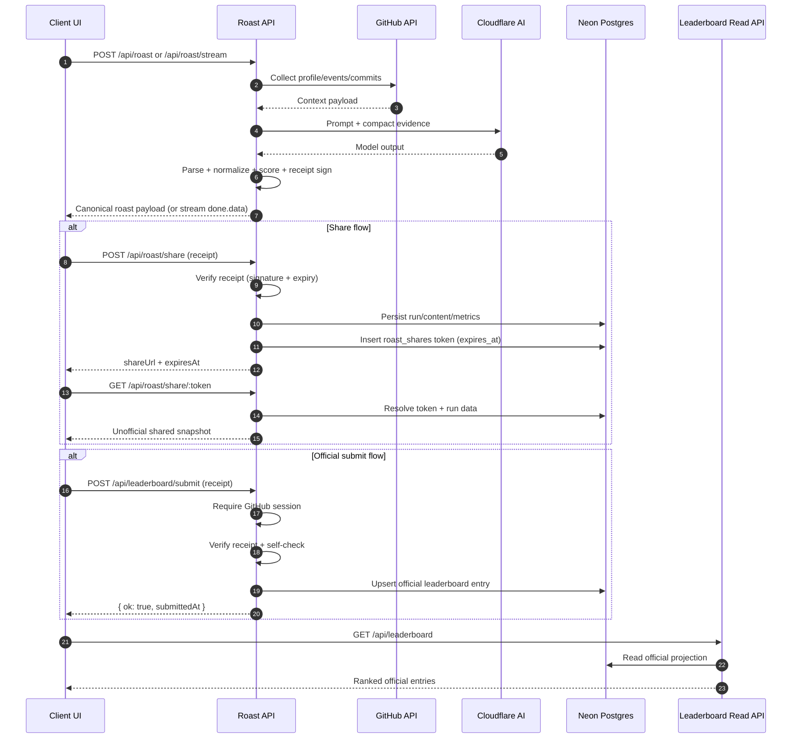

# Roast Architecture (v3.4)

Server-owned roast pipeline with typed streaming, signed receipt handoff, temporary sharing, and verified official leaderboard projection.

## Pipeline Overview

1. Request validation + runtime option resolution
2. GitHub context collection
3. Evidence selection
4. Prompt and AI config build
5. AI execution (sync or stream)
6. Output parse + canonical normalize
7. Deterministic scoring
8. Signed receipt issuance
9. Optional persistence (share/official submit)

## Sequence Diagram

## Ownership and Invariants

- Server owns all contracts and canonical final shapes.
- `done.data` is canonical in stream mode.
- `receipt` is mandatory for share/submit actions.
- Parser/normalizer failures are fail-fast with typed errors.
- Scores are deterministic and server-owned (not model-owned).
- Official submit is allowed only for verified self-roasts.

## Read/Write Model Split

- Write paths:
  - share create
  - official submit
- Read paths:
  - leaderboard list/detail (official only)
  - share token resolve (unofficial temporary snapshot)

## Observability Scopes

High-signal scopes:
- `receipt-issued`
- `share-created`
- `share-resolved`
- `official-submit-accepted`
- `official-submit-rejected`

Related docs:
- `stream-contract.md`
- `payload-contract.md`
- `database.md`
- `operations.md`

## Pipeline stages

1. Input normalization — trim, language detect, profanity gate.
2. Prompt assembly — persona block + intensity level + user payload.
3. Streamed generation — chunks forwarded as-is, no buffering.
4. Post pass — final formatting and safety check before persist.
- Reminder: sync safety gate docs with implementation changes.
- Edge case: normalization step on mobile safari needs a second look.
