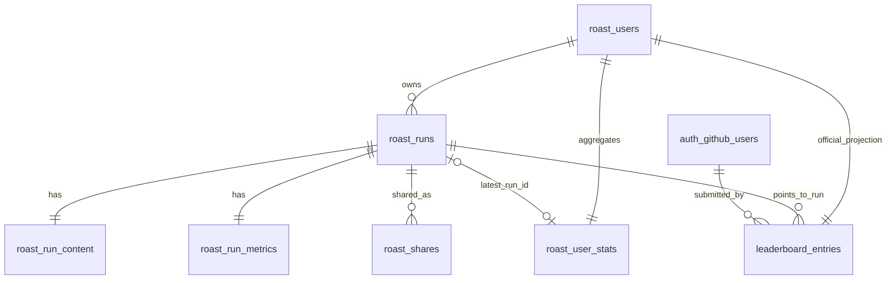

# Roast Database (v1.3)

Neon/Postgres schema for receipt-backed sharing and verified official leaderboard submissions.

## ER Diagram

## Tables

- `roast_users`
  - one row per roasted GitHub username
- `roast_runs`
  - one row per persisted run (`request_id` unique, idempotent)
- `roast_run_content`
  - 1:1 with `roast_runs`, text content fields
- `roast_run_metrics`
  - 1:1 with `roast_runs`, deterministic score fields
- `roast_user_stats`
  - aggregated per-user stats
- `roast_scoring_profiles`
  - versioned scoring configuration, one active profile
- `auth_github_users`
  - verified OAuth identities
- `roast_shares`
  - temporary share tokens + expiry
- `leaderboard_entries`
  - official projection, one entry per roasted user

## Constraints and Integrity

- `roast_intensity` constrained to `1..4`.
- Semantic intensity labels are now steak-level based (`rare`, `medium_rare`, `medium`, `burned_to_crisp`) while persisted values remain numeric.
- Canonical API/share payloads expose an `intensity` object with `{ level, label }`, derived from the stored numeric value.
- Score fields constrained to `0..100`.
- `grade` constrained to `F- | F | D- | D | C- | C | B | A`.
- FK chains use `ON DELETE CASCADE` on dependent run/share/official rows.

## Indexes

Core performance indexes include:
- `roast_users(username)`
- `roast_runs(created_at DESC)`
- `roast_runs(user_id, created_at DESC)`
- `roast_run_metrics(stink_score DESC, ego_damage DESC)`
- `roast_user_stats(worst_grade, avg_stink_score DESC)`
- `auth_github_users(username)`
- `roast_shares(expires_at)`
- `roast_shares(run_id)`
- `leaderboard_entries(submitted_at DESC)`
- `leaderboard_entries(run_id)`

## Persistence Semantics

- Unofficial roast generation: no automatic persistence by default.
- Share creation:
  - verifies receipt,
  - persists run/content/metrics,
  - stores token in `roast_shares` with `expires_at` (+24h).
- Official submit:
  - requires verified session,
  - enforces self-ownership,
  - upserts official projection in `leaderboard_entries`.

## TTL Cleanup Strategy

- Functional TTL enforcement: share resolve queries require `expires_at > NOW()`.
- Physical cleanup: scheduled deletion of expired rows in `roast_shares`.
- Recommended cadence: every 4 hours (`pg_cron`).

## Migrations

- `/Users/flame/Developer/Projects/grill-me/server/db/migrations/001_roast_leaderboard.sql`
- `/Users/flame/Developer/Projects/grill-me/server/db/migrations/002_roast_share_and_official_entries.sql`

Operational setup and runbook:
- `operations.md`
